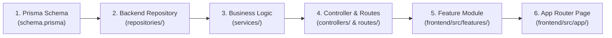

# 🚀 Capacity Connect — Enterprise Full-Stack Application

[](https://www.typescriptlang.org/)
[](https://nextjs.org/)
[](https://react.dev/)
[](https://expressjs.com/)
[](https://www.prisma.io/)
[](https://tailwindcss.com/)
[](https://www.docker.com/)

A production-ready, modular, full-stack enterprise architecture built with **Next.js App Router**, **Node.js/Express**, **Prisma ORM**, and **TypeScript**. Designed with Clean Architecture principles, it comes equipped with authentication, role-based access control (RBAC), user directory management, asynchronous workers, theme switching, and automated silent token refresh.

---

## 🛠️ Technology Stack

| Layer | Technologies & Libraries |
| :--- | :--- |
| **Frontend Framework** | Next.js 14 (App Router), React 18, TypeScript (Strict) |
| **Styling & Design** | Tailwind CSS, Lucide Icons, Custom Dark/Light Theme System |
| **State & Data Fetching** | Zustand (Global Client State), TanStack Query v5 (Server Cache & Synchronization) |
| **Form Handling** | React Hook Form, Zod Schema Validation |
| **Backend API** | Node.js, Express.js, TypeScript |
| **Database & ORM** | PostgreSQL (Default) / MongoDB (Supported), Prisma ORM |
| **Authentication** | JWT Access Tokens, HttpOnly Cookie Refresh Tokens, Bcrypt |
| **Authorization** | Role-Based Access Control (RBAC) with Granular Permissions |
| **Async & Infrastructure** | BullMQ (Queues), Cron (Jobs), Nodemailer (Emails), Multer (File Uploads), Redis (Cache) |
| **Logging & Monitoring** | Winston Multi-Stream Logger (Console & File Rotation) |
| **Containerization** | Docker, Docker Compose (PostgreSQL, Redis) |

---

## 🏗️ Detailed Project Structure & Functional Map

The repository is cleanly partitioned into modular layers. Below is the functional breakdown of the codebase:

```
capacity-connect/
├── backend/                  # REST API Server (Express + Prisma + TypeScript)
├── frontend/                 # Client Web Application (Next.js 14 App Router)
├── docs/                     # Architectural, API, and Deployment Guides
├── examples/                 # Optional recipes (MongoDB integration, Auth setups)
├── scripts/                  # Database management, seeding, and reset utilities
├── .env.example              # Centralized environment variable template
└── docker-compose.yml        # Multi-container orchestration (PostgreSQL & Redis)
```

---

### 1. 🖥️ Frontend Architecture (`frontend/src/`)

The frontend follows a **Feature-Driven Architecture** combined with Next.js App Router for optimal modularity, reusability, and code colocation:

```
frontend/src/
├── app/                      # Next.js App Router (Routing, Pages & Layouts)
│   ├── layout.tsx            # Root HTML layout with Theme & Query Providers
│   ├── providers.tsx         # TanStack Query & Theme Context Provider wrapper
│   ├── page.tsx              # Dashboard / Home view with analytics metric cards
│   ├── login/page.tsx        # Authentication view (Sign-in form & role switcher)
│   ├── users/page.tsx        # User Directory view (Admin RBAC protected)
│   └── profile/page.tsx      # User Profile view & account settings
│
├── features/                 # Domain-Specific Feature Modules
│   └── user/                 # User domain module
│       ├── api/userApi.ts    # User HTTP endpoints (Fetch, Create, Update, Delete)
│       ├── components/       # Feature UI (UserList, UserCard, UserForm)
│       ├── hooks/            # TanStack Query hooks (useUser, useUsers)
│       ├── validation/       # Zod schemas for user forms and payloads
│       └── types/            # TypeScript interfaces for user models
│
├── components/               # Global & Reusable UI Component Library
│   ├── layout/               # Shell components (AppShell, Sidebar navigation, Header)
│   ├── common/               # Shared widgets (LoadingSpinner, Modals, Error banners)
│   └── ui/                   # Atomic UI primitives (Button, Input, Dropdown)
│
├── api/                      # HTTP Networking & Interceptors
│   └── client.ts             # Axios instance with automatic 401 silent token refresh queue
│
├── store/                    # Global Client State Management
│   └── auth.ts               # Zustand store for user session and access tokens
│
├── context/                  # React Context Providers
│   └── ThemeContext.tsx      # Dark / Light theme engine with SSR safety
│
├── hooks/                    # Reusable React Hooks
│   └── useLocalStorage.ts    # SSR-safe state synchronization with Browser LocalStorage
│
├── config/                   # Frontend runtime configuration
├── constants/                # Immutable application constants (Route paths, Storage keys)
├── lib/                      # Third-party wrappers (clsx + tailwind-merge utility)
├── schemas/                  # Shared Zod validation schemas
├── services/                 # Analytics & telemetry client adapters
└── types/                    # Global ambient TypeScript definitions
```

---

### 2. ⚙️ Backend Architecture (`backend/src/`)

The backend is built with a **Layered Clean Architecture** that separates HTTP transport, business rules, data access, and asynchronous jobs:

```
backend/src/
├── index.ts                  # Server entry point, middleware registration & graceful shutdown
│
├── config/                   # Validated Environment Configurations
│   └── index.ts              # Zod-validated environment variables and application constants
│
├── auth/                     # Security & Token Management
│   └── ...                   # JWT generation, verification, password hashing, and cookie helpers
│
├── permissions/              # Role-Based Access Control (RBAC)
│   └── ...                   # Role definitions (SUPER_ADMIN, ADMIN, MANAGER, USER) & permission matrix
│
├── routes/                   # API Routing Layer
│   ├── index.ts              # Central router mounting all domain endpoints under /api/v1
│   └── user.routes.ts        # User & Auth endpoints with auth/role middleware guards
│
├── controllers/              # HTTP Transport Handlers
│   └── ...                   # Parses incoming HTTP requests, validates DTOs, and invokes services
│
├── services/                 # Business Logic Workflow Engine
│   └── ...                   # Core domain logic, multi-step workflows, and transaction handling
│
├── repositories/             # Data Access Abstraction Layer
│   └── ...                   # Decoupled Prisma query interfaces for database operations
│
├── database/                 # Database Client & Seeds
│   ├── client.ts             # Prisma Client singleton connection manager
│   └── seeds/                # Seed script populating initial Admin/User accounts
│
├── middlewares/              # Express Request Middlewares
│   └── ...                   # Auth guards, role verification, rate limiting, error middleware, request logger
│
├── validators/ & schemas/    # Request Validation
│   └── ...                   # Zod request body, query parameter, and param validator middlewares
│
├── dto/                      # Data Transfer Objects
│   └── ...                   # Request input contracts and sanitized response structures
│
├── errors/                   # Error Handling Subsystem
│   └── ...                   # Custom AppError classes, HTTP status mapping, and unhandled exception catches
│
├── logger/                   # Observability & Logging
│   └── ...                   # Winston logger formatting with file rotation (error.log, combined.log)
│
├── storage/ & uploads/       # File Management
│   └── ...                   # Multer storage adapters for file uploads (local disk & cloud storage ready)
│
├── mails/                    # Email Dispatcher
│   └── ...                   # Nodemailer configuration and HTML email templates (welcome, password reset)
│
├── cache/                    # Fast Memory Cache
│   └── ...                   # Redis connection manager and cache helper functions
│
├── queues/ & jobs/           # Asynchronous Background Processing
│   └── ...                   # BullMQ worker consumers and scheduled Cron jobs
│
└── events/ & notifications/  # Event Emitter & Alerts
    └── ...                   # Internal decoupled event buses and notification handlers
```

---

## ⚡ Out-of-the-Box Functional Capabilities

### 1. 🔐 Dual-Token Authentication & Silent Refresh
* **Access Tokens (JWT)**: Short-lived credentials for stateless API authentication.
* **Refresh Tokens (HttpOnly Cookie)**: Stored in a secured, HttpOnly cookie with database tracking (`RefreshToken` model).
* **Automatic Queue Interceptor**: If an access token expires while browsing, the frontend Axios interceptor pauses failing requests, triggers a silent background refresh, updates the token, and replays all queued requests with zero disruption.

### 2. 🛡️ Role-Based Access Control (RBAC)
* **Predefined Roles**: `SUPER_ADMIN`, `ADMIN`, `MANAGER`, `USER`.
* **Backend Middleware**: Guard routes using `authenticate` and `authorizeRoles(['ADMIN', 'SUPER_ADMIN'])`.
* **Frontend Guards**: Dynamic navigation items and protected views automatically adjust based on the authenticated user's permissions.

### 3. 👥 User Management & Profiles
* **Full CRUD**: Create users, list directory with pagination, update profile details, and soft/hard delete accounts.
* **Self-Service**: Account settings and profile management for active users.

### 4. 🎨 Design System & Theme Engine
* **Theme Switching**: Dark / Light mode toggling with smooth transitions and persistent state.
* **Enterprise AppShell**: Collapsible sidebar, responsive navigation, user status chips, and breadcrumb headers.

### 5. 🗄️ Database & Migration Pipeline
* **Prisma ORM**: Type-safe database queries with automated migrations (`prisma migrate dev`).
* **Multi-DB Ready**: Pre-configured for PostgreSQL with seamless migration recipes for MongoDB.

---

## 🚀 Quick Start Guide

### 1. Environment Setup
Copy the example environment file to `.env`:
```bash
cp .env.example .env
```
*(Review and update database credentials, JWT secrets, and ports as needed).*

### 2. Start Infrastructure (Docker Compose)
Launch PostgreSQL and Redis containers:
```bash
docker-compose up -d
```

### 3. Start Backend Server
```bash
cd backend
npm install
npx prisma migrate dev       # Apply database migrations
npm run prisma:seed          # Seed test accounts
npm run dev                  # Start hot-reloading Express server on port 5000
```
*Backend API available at: `http://localhost:5000/api/v1`*

### 4. Start Frontend Client
```bash
cd ../frontend
npm install
npm run dev                  # Start Next.js hot-reloading dev server on port 3000
```
*Frontend Web Application available at: `http://localhost:3000`*

---

## 🔒 Pre-Seeded Test Accounts

When you run `npm run prisma:seed` in the backend, the following accounts are created:

| Role | Email | Password | Access Level |
| :--- | :--- | :--- | :--- |
| **Super Admin** | `admin@enterprise.com` | `AdminPassword123!` | Full system access & User Directory management |
| **Standard User** | `user@enterprise.com` | `UserPassword123!` | Standard Dashboard and Profile access |

---

## 💡 How to Plan & Add New Features

To implement a new feature module (e.g., `projects` or `capacity`):



1. **Database Model**: Add your model to `backend/prisma/schema.prisma` and run `npx prisma migrate dev`.
2. **Backend Repository & Service**: Create queries in `repositories/` and business workflows in `services/`.
3. **Backend Controller & Route**: Validate inputs with Zod schemas in `validators/` and mount the route in `routes/index.ts`.
4. **Frontend Feature Module**: Create a new folder under `frontend/src/features/<feature-name>/` containing `api/`, `hooks/`, and `components/`.
5. **Frontend View**: Create the corresponding route under `frontend/src/app/<route-name>/page.tsx` wrapped in `<AppShell>`.

---

## 📚 Detailed Documentation

For in-depth guides, consult the [`docs/`](./docs) folder:
* 🧱 **[Architecture Guide](./docs/architecture.md)** — Clean Architecture & SOLID principles.
* 🛠️ **[Customization Guide](./docs/customization.md)** — Step-by-step feature expansion.
* 📂 **[Structure Reference](./docs/structure.md)** — Detailed directory reference.
* 🌐 **[REST API Specifications](./docs/api.md)** — Request/Response schema contracts.
* 🚢 **[Production Deployment](./docs/deployment.md)** — Docker multi-stage builds and Nginx deployment.
