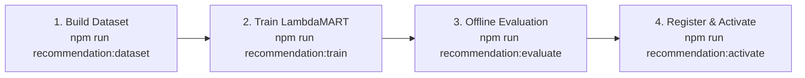

# Capacity Connect — ML Model Deployment & Retraining Guide
**Hybrid Learning-to-Rank Recommendation Engine**
*Ministry of Earth Sciences (MoES) / India Meteorological Department (IMD)*

---

## 1. Architectural Overview

The Capacity Connect Recommendation Engine implements a **Hybrid Learning-to-Rank (LTR)** architecture combining:
1. **Offline Training & Evaluation**: Group-wise LambdaMART ranking optimization using LightGBM / Tree Boosters in Python.
2. **In-Process Inference**: Zero-overhead TypeScript evaluation of the LightGBM Booster JSON artifact ($<0.1\text{ms}$ per candidate), eliminating slow Python subprocess invocation on HTTP requests.
3. **Resilient Fallback**: Automatic, seamless delegation to the deterministic `BaselineRanker` whenever no model is registered, during cold-start, or if unexpected errors occur.
4. **Pedagogical Re-ranking**: Post-ranking safety filters enforcing prerequisite readiness, protecting mission-critical skill gaps, ensuring MMR category diversity, and injecting controlled 10–20% exploration.

---

## 2. Graded Educational Outcome Labels

Training targets educational utility rather than raw clicks. The label hierarchy is:

| Label Score | Outcome Event | Educational Meaning |
|---|---|---|
| **5** | `COMPETENCY_IMPROVEMENT` | Highest Signal: Verified competency level increase following recommendation |
| **4** | `COURSE_COMPLETED` | Strong Signal: Successful course completion with all module requirements met |
| **3** | `COURSE_STARTED` / `ENROLL` | Positive Signal: Learner committed to studying the course |
| **2** | `CLICK_OR_SAVE` | Engagement Signal: Course was bookmarked or viewed in detail |
| **1** | `IMPRESSION` | Neutral: Course was displayed in viewport without user action |
| **0** | `DISMISSED` / `ABANDON` | Negative Signal: Explicitly dismissed or dropped early |

---

## 3. End-to-End Retraining Workflow

All steps are managed via standardized npm and Python CLI commands:



### Step 1: Export Historical Dataset
Extracts historical recommendation batches and outcome attributions with a **70% Train / 15% Validation / 15% Test temporal split** (older batches $\to$ train, newest batches $\to$ test):

```bash
# Using npm
npm run recommendation:dataset

# Or directly in Python
python ml/training/build_dataset.py --output_path ml/data/latest_dataset.json --queries 150
```

### Step 2: Train LightGBM LambdaMART Model
Trains decision tree ensembles with group queries using early stopping on validation NDCG@10:

```bash
# Using npm
npm run recommendation:train

# Or directly in Python
python ml/training/train.py --dataset_path ml/data/latest_dataset.json --learning_rate 0.05 --num_leaves 31 --n_estimators 100
```
**Artifacts Generated**:
- `ml/models/model_<version>.json`: Standard LightGBM Booster JSON artifact.
- `ml/models/active_model.json`: Candidate model pointer.

### Step 3: Offline Model Evaluation
Computes NDCG@3, NDCG@5, NDCG@10, MAP@10, MRR, Precision@5, and Recall@5 on the hold-out test set, comparing directly against the deterministic `BaselineRanker`:

```bash
# Using npm
npm run recommendation:evaluate

# Or directly in Python
python ml/evaluation/evaluate.py --dataset_path ml/data/latest_dataset.json --model_path ml/models/active_model.json
```
**Sample Evaluation Output**:
```
=======================================================
         OFFLINE RECOMMENDATION EVALUATION RESULTS     
=======================================================
Evaluated Query Groups : 18
NDCG@3                 : 0.9327
NDCG@5                 : 0.9586
NDCG@10                : 0.9709
MAP@10                 : 0.9047
MRR                    : 0.9722
Precision@5            : 0.7000
Recall@5               : 0.9239
Baseline NDCG@10       : 0.9042
ML Improvement vs Base : +7.38%
=======================================================
```

### Step 4: Model Activation
Registers model metadata in PostgreSQL table `ml_model_registry`, validates quality gates, and marks the model `ACTIVE`. The previous active model is automatically transitioned to `RETIRED`:

```bash
# CLI activation
npm run recommendation:activate
```

Alternatively, administrators can activate models via REST API:
```http
POST /api/v1/recommendations/admin/models/:version/activate
Authorization: Bearer <ADMIN_JWT_TOKEN>
```

---

## 4. Administrative API Reference

All administrative endpoints require `Role.ADMIN` or `Role.SUPER_ADMIN`:

| Method | Endpoint | Description |
|---|---|---|
| `GET` | `/api/v1/recommendations/admin/models` | List all registered models, versions, and evaluation metrics |
| `GET` | `/api/v1/recommendations/admin/models/:version` | Detailed metrics and hyperparameters for specific model |
| `POST` | `/api/v1/recommendations/admin/models/:version/activate` | Explicitly activate model version in production |
| `POST` | `/api/v1/recommendations/admin/models/:version/retire` | Retire model (system automatically falls back to baseline) |
| `GET` | `/api/v1/recommendations/metrics` | Platform-wide outcome attribution and conversion metrics |

---

## 5. Fail-Safe & Zero-Downtime Design

1. **In-Memory Cache & Hot-Reloading**: `ModelLoader` caches the active booster in memory. When a new model is activated, an event `model.activated` invalidates the cache immediately.
2. **Crash-Proof Fallback**: If the database is unreachable or the model artifact is missing, `ModelLoader` logs a warning and falls back to `ml/models/active_model.json` on disk. If that is also absent, `RankingService` automatically invokes `BaselineRanker`.
3. **No Empty Lists**: Recommendations are never empty solely because of ML or database blips; eligible educational content is always delivered.
