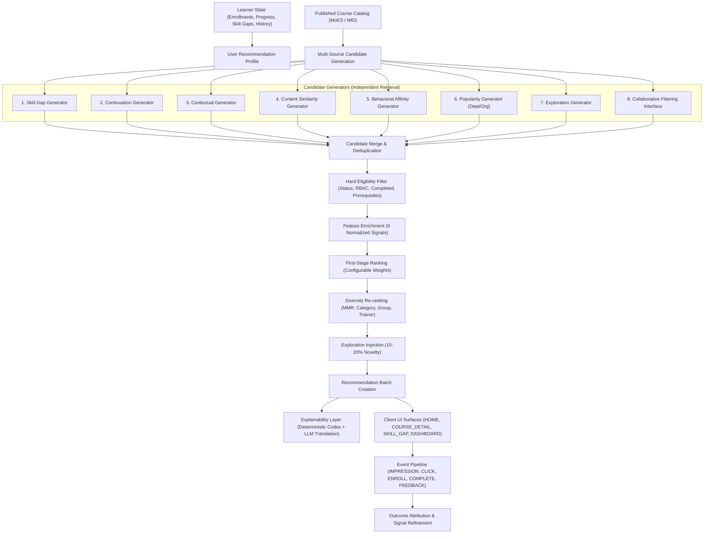

# Intelligent Recommendation Engine — Implementation Plan
**Capacity Connect — Ministry of Earth Sciences (MoES) / India Meteorological Department (IMD)**

---

## Executive Summary

The **Intelligent Recommendation Engine** provides a multi-stage, educational recommendation system for Capacity Connect. Built on candidate generation, hard eligibility filtering, multi-signal ranking, MMR-style diversity re-ranking, and controlled exploration, the engine prioritizes **learner skill gaps, prerequisite safety, and educational outcomes** rather than click-maximization.

The LLM is strictly positioned as a **pedagogical explainer** converting deterministic reason codes into natural language—it **never** scores, ranks, or filters content.

---

## User Review Required

> [!IMPORTANT]
> **Domain-Specific Alignment (MoES / IMD)**: All recommendation candidates, categories, features, and synthetic test scenarios are built around atmospheric sciences, numerical weather prediction (NWP), radar meteorology (DWR), satellite meteorology (INSAT), seismology, ocean forecasting (INCOIS), and meteorological instrumentation.

> [!IMPORTANT]
> **Data Integrity & Non-Destructive Extension**: Existing database models (`Recommendation`, `Course`, `CoursePrerequisite`, `CourseCompetency`, `UserCompetency`, `SkillGap`, `Enrollment`, `Feedback`) are preserved. New tables (`RecommendationBatch`, `RecommendationEvent`, `RecommendationFeedback`, `RecommendationAlgorithmConfig`, `UserRecommendationProfile`, `CourseRecommendationProfile`) extend the system with zero breaking changes.

---

## Proposed Architectural Flow



---

## Proposed Changes

### Component 1: Database Layer (`backend/prisma/schema.prisma`)

#### [MODIFY] [schema.prisma](file:///d:/projects/capacity-connect/backend/prisma/schema.prisma)
1. **Extend `Recommendation` Model**:
   - Add `batchId String?`, `rankPosition Int?`, `algorithmVersion String @default("v1.0.0")`, `surface String @default("HOME")`, `candidateSource String?`, `reasonCodes String[] @default([])`, `featureSnapshot Json?`, `shownAt DateTime?`, `clickedAt DateTime?`, `actedAt DateTime?`.
   - Add relations to `RecommendationBatch`, `RecommendationEvent[]`, `RecommendationFeedback[]`.
2. **Add `RecommendationBatch` Model**:
   - `id`, `userId`, `surface`, `context`, `algorithmVersion`, `createdAt`, `expiresAt`.
3. **Add `RecommendationEvent` Model**:
   - `id`, `userId`, `recommendationId?`, `batchId?`, `eventType` (`IMPRESSION`, `VIEW`, `CLICK`, `SAVE`, `DISMISS`, `START`, `ENROLL`, `COMPLETE`, `ABANDON`, `SHARE`), `position?`, `surface`, `courseId?`, `resourceId?`, `trainerId?`, `sessionId?`, `metadata?`, `createdAt`.
4. **Add `RecommendationFeedback` Model**:
   - `id`, `userId`, `recommendationId`, `feedbackType` (`NOT_RELEVANT`, `ALREADY_KNOW_THIS`, `TOO_DIFFICULT`, `TOO_EASY`, `NOT_NOW`, `WRONG_TOPIC`, `INTERESTING`), `reason?`, `rating?`, `createdAt`.
5. **Add `RecommendationAlgorithmConfig` Model**:
   - Versioned weights: `skillWeight` (0.25), `contentWeight` (0.15), `behaviorWeight` (0.15), `collaborativeWeight` (0.10), `qualityWeight` (0.10), `contextWeight` (0.08), `popularityWeight` (0.07), `freshnessWeight` (0.05), `explorationWeight` (0.05).
   - Dynamic parameters: `explorationPercentage` (0.15), `diversityLambda` (0.70), `maxSameCategory` (3), `maxSameGroup` (2), `maxSameTrainer` (2), `minimumEvidence` (3).
6. **Add `UserRecommendationProfile` Model**:
   - Derived user attributes: `preferredCategories`, `preferredDifficulty`, `interestTopics`, `recentCourses`, `engagementScore`, `updatedAt`.
7. **Add `CourseRecommendationProfile` Model**:
   - Derived course metrics: `qualityScore`, `completionRate`, `averageRating`, `popularityScore`, `freshnessScore`, `engagementScore`, `updatedAt`.
8. Apply via `npx prisma db push` and regenerate Prisma client.

---

### Component 2: Core Algorithmic Foundation (`backend/src/modules/recommendation/algorithms/`)

#### [NEW] [skill-relevance.algorithm.ts](file:///d:/projects/capacity-connect/backend/src/modules/recommendation/algorithms/skill-relevance.algorithm.ts)
- Computes skill alignment:
  $$\text{SkillRelevance} = \frac{\sum (\text{gapSeverity}_i \times \text{coverage}_i \times \text{importance}_i \times M_{\text{crit}})}{\text{NormalizationFactor}} \times 100$$
- Matches open `SkillGap` records against `CourseCompetency` target levels.

#### [NEW] [content-similarity.algorithm.ts](file:///d:/projects/capacity-connect/backend/src/modules/recommendation/algorithms/content-similarity.algorithm.ts)
- Computes cosine similarity between course metadata/topics/categories and user profile/interest vectors normalized to $[0, 100]$.

#### [NEW] [behavioral-affinity.algorithm.ts](file:///d:/projects/capacity-connect/backend/src/modules/recommendation/algorithms/behavioral-affinity.algorithm.ts)
- Computes exponential time-decayed behavioral affinity from historical learner actions (`COMPLETE`: +25, `ENROLL`: +15, `START`: +10, `SAVE`: +8, `VIEW`: +3, `ABANDON`: -15, `DISMISS`: -20).

#### [NEW] [collaborative.algorithm.ts](file:///d:/projects/capacity-connect/backend/src/modules/recommendation/algorithms/collaborative.algorithm.ts)
- Extensible collaborative filtering algorithm using Jaccard/cosine similarity over completed courses and competency gains across peer learners within the department/organization. Returns 0 for cold-start users without fabricating signals.

#### [NEW] [quality.algorithm.ts](file:///d:/projects/capacity-connect/backend/src/modules/recommendation/algorithms/quality.algorithm.ts)
- Computes course quality from completion rate, feedback rating with Bayesian dampening (minimum evidence threshold), and assessment improvement.

#### [NEW] [freshness.algorithm.ts](file:///d:/projects/capacity-connect/backend/src/modules/recommendation/algorithms/freshness.algorithm.ts)
- Half-life time decay based on publication date and major update date, protecting evergreen foundational courses from harsh penalties.

#### [NEW] [contextual.algorithm.ts](file:///d:/projects/capacity-connect/backend/src/modules/recommendation/algorithms/contextual.algorithm.ts)
- Evaluates surface context (e.g. current course, recently completed course, active department focus).

#### [NEW] [diversity.algorithm.ts](file:///d:/projects/capacity-connect/backend/src/modules/recommendation/algorithms/diversity.algorithm.ts)
- Maximal Marginal Relevance (MMR) re-ranker:
  $$\text{Score}_{\text{MMR}}(c) = \lambda \cdot \text{Relevance}(c) - (1 - \lambda) \cdot \max_{s \in S} \text{Similarity}(c, s)$$
- Constrained by `maxSameCategory` and `maxSameTrainer` unless a critical skill gap requires multiple related courses.

#### [NEW] [exploration.algorithm.ts](file:///d:/projects/capacity-connect/backend/src/modules/recommendation/algorithms/exploration.algorithm.ts)
- Selects 10-20% novel, skill-adjacent candidates that pass hard eligibility to prevent filter bubbles.

---

### Component 3: Candidate Generators (`backend/src/modules/recommendation/candidate-generators/`)

#### [NEW] [skill-gap.generator.ts](file:///d:/projects/capacity-connect/backend/src/modules/recommendation/candidate-generators/skill-gap.generator.ts)
- Queries active skill gaps for user, finds courses mapped to those competencies.
#### [NEW] [continuation.generator.ts](file:///d:/projects/capacity-connect/backend/src/modules/recommendation/candidate-generators/continuation.generator.ts)
- Finds next logical course in a learning path or uncompleted enrolled courses.
#### [NEW] [contextual.generator.ts](file:///d:/projects/capacity-connect/backend/src/modules/recommendation/candidate-generators/contextual.generator.ts)
- Candidates based on currently viewed course or recently completed course.
#### [NEW] [content.generator.ts](file:///d:/projects/capacity-connect/backend/src/modules/recommendation/candidate-generators/content.generator.ts)
- Semantic similarity candidates.
#### [NEW] [behavioral.generator.ts](file:///d:/projects/capacity-connect/backend/src/modules/recommendation/candidate-generators/behavioral.generator.ts)
- Candidates aligned with recent engagement patterns.
#### [NEW] [popularity.generator.ts](file:///d:/projects/capacity-connect/backend/src/modules/recommendation/candidate-generators/popularity.generator.ts)
- Contextual popularity (department / division first, global platform fallback).
#### [NEW] [exploration.generator.ts](file:///d:/projects/capacity-connect/backend/src/modules/recommendation/candidate-generators/exploration.generator.ts)
- Skill-adjacent novel candidates.
#### [NEW] [collaborative.generator.ts](file:///d:/projects/capacity-connect/backend/src/modules/recommendation/candidate-generators/collaborative.generator.ts)
- Peer-pattern candidates with cold-start safety.

---

### Component 4: Services, Filtering & Ranking (`backend/src/modules/recommendation/services/`)

#### [NEW] [eligibility.service.ts](file:///d:/projects/capacity-connect/backend/src/modules/recommendation/services/eligibility.service.ts)
- Hard filter:
  1. `CourseStatus === 'PUBLISHED'` (non-trainees respect status visibility).
  2. Role & Department access checks.
  3. `CoursePrerequisite`: If prerequisite uncompleted, exclude or substitute prerequisite.
  4. Consumption check: Exclude completed courses unless refresher/spaced-review flagged.
  5. Inactive/deleted course exclusion.

#### [NEW] [ranking.service.ts](file:///d:/projects/capacity-connect/backend/src/modules/recommendation/services/ranking.service.ts) & [weighted-ranker.ts](file:///d:/projects/capacity-connect/backend/src/modules/recommendation/ranking/weighted-ranker.ts)
- Builds feature vector for each candidate:
  $$\text{FinalScore} = \sum_{k} w_k \cdot f_k$$
- Ranks candidates, passes top-30 to diversity re-ranker, injects exploration candidates.

#### [NEW] [recommendation.service.ts](file:///d:/projects/capacity-connect/backend/src/modules/recommendation/services/recommendation.service.ts)
- Master coordinator: fetches profile, triggers generators, merges & deduplicates, runs eligibility filter, ranks, diversifies, persists batch, and generates explanations.

#### [NEW] [event.service.ts](file:///d:/projects/capacity-connect/backend/src/modules/recommendation/services/event.service.ts)
- Ingests impressions, clicks, saves, dismissals, enrollments, and completions.

#### [NEW] [feedback.service.ts](file:///d:/projects/capacity-connect/backend/src/modules/recommendation/services/feedback.service.ts)
- Records structured user feedback (`NOT_RELEVANT`, `TOO_DIFFICULT`, etc.) and adjusts affinity vectors.

#### [NEW] [outcome.service.ts](file:///d:/projects/capacity-connect/backend/src/modules/recommendation/services/outcome.service.ts)
- Links recommendation $\to$ enrollment $\to$ course completion $\to$ competency improvement for educational outcome attribution.

---

### Component 5: AI Explanation Layer (`backend/src/modules/recommendation/ai/`)

#### [NEW] [recommendation.schema.ts](file:///d:/projects/capacity-connect/backend/src/modules/recommendation/ai/recommendation.schema.ts)
- Zod schema for structured pedagogical explanation.
#### [NEW] [recommendation-prompt.ts](file:///d:/projects/capacity-connect/backend/src/modules/recommendation/ai/recommendation-prompt.ts)
- Zero-PII prompt builder providing course summary, gap match, and deterministic reason codes.
#### [NEW] [recommendation-explainer.ts](file:///d:/projects/capacity-connect/backend/src/modules/recommendation/ai/recommendation-explainer.ts)
- LLM caller with robust deterministic MoES/IMD scientific fallback.

---

### Component 6: API Routes & Controllers (`backend/src/modules/recommendation/`)

#### [NEW] [recommendation.controller.ts](file:///d:/projects/capacity-connect/backend/src/modules/recommendation/recommendation.controller.ts) & [recommendation.routes.ts](file:///d:/projects/capacity-connect/backend/src/modules/recommendation/recommendation.routes.ts)
- Mounted at `/api/v1/recommendations`:
  - `GET /`: Get recommendations for authenticated user with surface filtering.
  - `POST /refresh`: Force re-generation of recommendation batch.
  - `GET /:id`: Get recommendation details.
  - `POST /:id/event`: Record interaction event (`IMPRESSION`, `CLICK`, etc.).
  - `POST /:id/feedback`: Record learner feedback.
  - `GET /history`: Get batch history.
  - `GET /trainer/courses/:courseId/performance`: Trainer recommendation analytics.
  - `GET /admin/analytics`: Platform-wide conversion & outcome analytics.
- Mount router in [`backend/src/routes/index.ts`](file:///d:/projects/capacity-connect/backend/src/routes/index.ts).

---

### Component 7: Seeding, Tests & Verification

#### [MODIFY] [backend/prisma/seed.ts](file:///d:/projects/capacity-connect/backend/prisma/seed.ts)
- Seed initial `RecommendationAlgorithmConfig` (`v1.0.0`).
- Seed sample recommendation batch and interactions.

#### [NEW] [backend/src/modules/recommendation/tests/](file:///d:/projects/capacity-connect/backend/src/modules/recommendation/tests/)
- `candidate-generation.test.ts`: Tests all 8 candidate generators.
- `eligibility.test.ts`: Tests prerequisite, status, and consumption filtering.
- `ranking.test.ts`: Tests multi-signal formula and weight balancing.
- `diversity.test.ts`: Tests MMR re-ranking and category limits.
- `simulations.test.ts`: End-to-end testing of Scenarios A through J (Section 65).

---

## Verification Plan

### Automated Tests
1. **Algorithmic & Unit Tests**:
   ```powershell
   npx jest src/modules/recommendation/tests/
   ```
2. **Full Regression Suite**:
   ```powershell
   npx jest src/modules/recommendation/tests/ src/modules/skill-gap/tests/ src/modules/revision/tests/
   ```
3. **TypeScript Strict Typecheck**:
   ```powershell
   npm run typecheck
   ```
4. **Prisma Validation & DB Push**:
   ```powershell
   npx prisma validate
   npx prisma db push
   ```

### Manual & Simulation Verification
- Verify Scenarios A through J from Section 65 of `docs/prompt/reccomendation.txt`:
  - Scenario A: Critical skill gap outranks general popularity.
  - Scenario B: Course completion boosts logical next course.
  - Scenario C: Missing prerequisite surfaces prerequisite first.
  - Scenario D: Learner preference weighting.
  - Scenario E: Negative feedback reduces category affinity.
  - Scenario F: MMR breaks up homogeneous recommendation lists.
  - Scenario G: Cold-start new learner.
  - Scenario H: Cold-start new course.
  - Scenario I: Critical skill gap remains competitive against trending noise.
  - Scenario J: Resilient fallback when LLM is unavailable.
