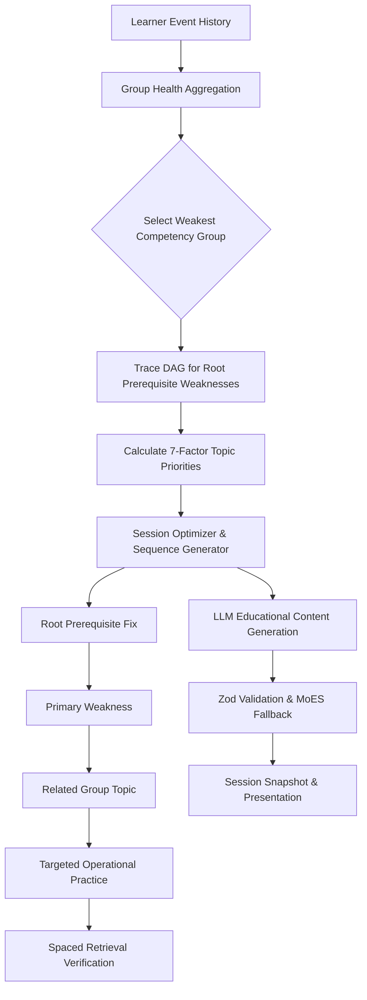

# Capacity Connect: Adaptive Competency-Based Revision Engine

## 1. Executive Summary

In meteorological and earth science operations (Ministry of Earth Sciences, India Meteorological Department), understanding atmospheric dynamics, radar signatures, and numerical modeling is strictly hierarchical. Presenting scattered, random revision topics to a meteorologist or radar operator disrupts conceptual coherence and fails to repair prerequisite knowledge gaps.

The **Adaptive Competency-Based Revision Engine** provides an automated, mathematically rigorous revision system. It:
1. Identifies the learner's weakest competency group.
2. Uncovers root prerequisite weaknesses via Directed Acyclic Graph (DAG) analysis.
3. Computes a multi-factor topic priority ranking.
4. Generates a structured sequence of instructional review, practical application, and retrieval verification.
5. Uses Large Language Models (LLMs) **exclusively** for generating MoES/IMD operational instructional content, backed by resilient offline fallbacks.



---

## 2. Core Mathematical Architecture

### 2.1 Multi-Component Performance Formulation
$$P = 0.55 \cdot \text{acc} + 0.15 \cdot \text{speed} + 0.10 \cdot \text{hint} + 0.10 \cdot \text{conf} + 0.10 \cdot \text{indep}$$
- **Accuracy ($\text{acc}$)**: Raw score fraction $[0.0, 1.0]$.
- **Speed Score ($\text{speed}$)**: Ratio of response time to expected time $[0.2, 1.0]$.
- **Hint Score ($\text{hint}$)**: Penalizes hint reliance ($0 \to 1.0, 1 \to 0.6, 2 \to 0.2, 3+ \to 0.0$).
- **Confidence Rating ($\text{conf}$)**: Self-reported calibration score $[0.1, 1.0]$.
- **Independence ($\text{indep}$)**: $1.0$ for independent answers; $0.4$ if external assistance was requested.

### 2.2 Bounded Adaptive Learning Rate ($\alpha$)
$$\alpha = \text{clamp}\left(0.10, 0.30, \frac{0.30}{1.0 + 0.12 \cdot N}\right) \times w_{\text{diff}}$$
Early attempts adapt quickly ($\alpha \approx 0.30$) while mature records converge smoothly ($\alpha \approx 0.10$) to prevent volatile score oscillations.

### 2.3 Spaced Memory Retention & Stability
$$R = \exp\left(-\frac{\Delta t}{S}\right), \quad F = 1 - R$$
- **Stability Expansion**: Successful recall ($P \ge 0.70$) expands stability:
  $$S_{\text{new}} = S \cdot \left(1 + 1.2 \cdot P \cdot \min\left(2.0, 1.0 + \frac{\Delta t}{S}\right)\right)$$
- **Stability Contraction**: Failed recall ($P < 0.50$) contracts stability:
  $$S_{\text{new}} = \max\left(0.5, S \cdot 0.5\right)$$

### 2.4 Competency Group Priority Score ($GP$)
$$GP = 0.40 \cdot GW + 0.20 \cdot GF + 0.15 \cdot GI + 0.15 \cdot GD + 0.10 \cdot GU$$
- **$GW$ (Group Weakness)**: $100 - \bar{S}$, boosted by 12% if the group has root prerequisite weaknesses.
- **$GF$ (Group Forgetting Risk)**: $(1 - \bar{R}) \cdot 100$.
- **$GI$ (Structural Importance)**: $(\bar{I} / 5.0) \cdot 100$.
- **$GD$ (Downstream DAG Impact)**: Weighted sum of downstream dependent concepts.
- **$GU$ (Urgency)**: $\min(100, \Delta t \times 3.5)$.

### 2.5 7-Factor Topic Priority Score ($TP$)
$$TP = 0.35 \cdot W + 0.18 \cdot F + 0.12 \cdot I + 0.12 \cdot D + 0.10 \cdot E + 0.08 \cdot U + 0.05 \cdot R$$

---

## 3. Pedagogical Sequence Optimization

Sessions are constructed with strict group coherence:
- **70% Primary Weak Group topics**
- **20% Root/Prerequisite repair**
- **10% Spaced retention / retrieval check**

### Sequence Order:
1. `ROOT_PREREQUISITE`: Remediates the deepest failing prerequisite (e.g. *Hydrostatic Balance* or *Radar Reflectivity Factor*).
2. `PRIMARY_WEAKNESS`: Targets the highest priority struggling concept in the focus group (e.g. *Nyquist Velocity Dealiasing*).
3. `RELATED_WEAKNESS`: Extends the mental model to an associated concept in the same group.
4. `TARGETED_PRACTICE`: Operational scenario drills and practical questions.
5. `RETRIEVAL_VERIFICATION`: High-yield active recall check to consolidate memory half-life.

---

## 4. Verification and Simulation Results

All pure algorithms and 10 end-to-end simulation scenarios have been validated with Jest:

```
PASS src/modules/revision/tests/simulations.test.ts
PASS src/modules/revision/tests/pure-algorithms.test.ts

Test Suites: 2 passed, 2 total
Tests:       27 passed, 27 total
Snapshots:   0 total
Time:        5.79 s
```

### Verified Scenarios:
1. **Beginner with foundational gaps**: Prioritizes root prerequisite before advanced topics.
2. **Intermediate learner with long lapse**: Captures exponential forgetting decay.
3. **Advanced learner with recurring error**: Penalizes error severity while preserving base score.
4. **Erratic learner with high score variance**: Flags low confidence and triggers diagnostic verification.
5. **Fast guesser**: Penalizes zero accuracy despite high answering speed.
6. **Slow methodical learner**: Rewards accuracy without excessive penalty for speed.
7. **Hint-dependent learner**: Correctly discounts independence score.
8. **Overconfident learner**: Recalibrates score smoothly via bounded learning rate.
9. **Long absence learner (90 days)**: Maximizes urgency and flags near-zero retention.
10. **Multi-domain learner with scattered weaknesses**: Confines revision to the single weakest group to maintain cognitive focus.
