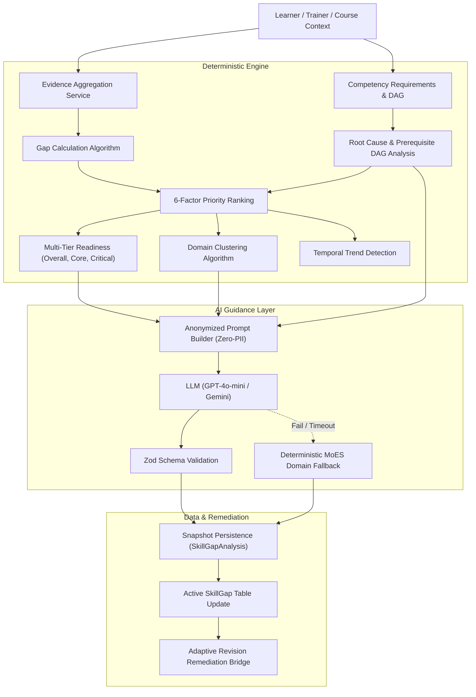

# AI Skill Gap Analyzer — Engineering Specification & Architecture
**Capacity Connect — Ministry of Earth Sciences (MoES) / India Meteorological Department (IMD)**

---

## 1. Executive Summary

The **AI Skill Gap Analyzer** is a production-grade, deterministic diagnostic and developmental guidance platform implemented for Capacity Connect. It bridges the gap between learner performance records, course prerequisite requirements, and adaptive educational revision sequences across specialized meteorological, oceanographic, and geophysical domains.

### Key Tenets
1. **Deterministic Authority**: Numerical gap calculations, prioritization scoring, prerequisite DAG traversals, multi-tier readiness determinations, and trend classifications are computed via pure, auditable algorithms.
2. **LLM as Scientific Narrator**: The LLM is strictly constrained to educational interpretation and learning path narration. It never calculates scores, invents skills, or overrides readiness decisions.
3. **Resilient Domain Fallback**: If LLM providers are unavailable or fail validation, the system automatically falls back to deterministic, schema-compliant MoES/IMD scientific guidance with zero service disruption.
4. **Zero-PII Transmission**: All learner identifiers (names, emails, user UUIDs) are stripped before generating guidance prompts.

---

## 2. Core Architecture



---

## 3. Mathematical Specifications

### 3.1 Raw Gap & Severity
For competency $i$:
$$\text{rawGap}_i = \max(0, \text{requiredLevel}_i - \text{currentLevel}_i)$$
$$\text{gapSeverity}_i = \begin{cases} 
\min\left(100, \max\left(0, \frac{\text{rawGap}_i}{\text{requiredLevel}_i} \times 100\right)\right) & \text{if } \text{requiredLevel}_i > 0 \\
0 & \text{otherwise}
\end{cases}$$

### 3.2 6-Factor Gap Priority Ranking
$$\text{BasePriority}_i = 0.35 \cdot \text{Sev}_i + 0.20 \cdot \text{Imp}_i + 0.15 \cdot \text{Dep}_i + 0.10 \cdot \text{Unc}_i + 0.10 \cdot \text{Fgt}_i + 0.10 \cdot \text{Err}_i$$

Criticality Multipliers ($M_{crit}$):
- `CORE`: $1.25$
- `IMPORTANT`: $1.10$
- `NORMAL`: $1.00$
- `OPTIONAL`: $0.80$

$$\text{FinalPriority}_i = \text{clamp}_{[0, 100]}(\text{BasePriority}_i \times M_{crit})$$

### 3.3 Multi-Tier Readiness & Hard Gating
- **Overall Readiness**:
  $$\text{OverallReadiness} = \frac{\sum (\min(\text{required}_i, \text{current}_i) \times w_i)}{\sum (\text{required}_i \times w_i)} \times 100$$
- **Core Readiness**: Evaluated over competencies with `criticality === 'CORE'`.
- **Critical Readiness**: Evaluated over competencies with `criticality in ('CORE', 'IMPORTANT')`.

**Hard Gating Invariants**:
- Any `CORE` competency deficiency forces status to `CONDITIONAL` or `NOT_READY`.
- A learner cannot be `FULLY_READY` or `GENERALLY_READY` if a core prerequisite is unmet.

---

## 4. API Endpoints

All endpoints are mounted under `/api/v1/skill-gaps` and protected with JWT Bearer authentication.

### `POST /api/v1/skill-gaps/analyze`
Executes complete deterministic analysis, trends, clusters, readiness, and AI guidance.
```json
{
  "courseId": "3b290bf4-b816-43b9-a297-76fe505d9e5d",
  "includeAiGuidance": true
}
```

### `GET /api/v1/skill-gaps`
Returns current open skill gaps for learner, sorted by priority.

### `GET /api/v1/skill-gaps/readiness`
Lightweight readiness evaluation against target course or platform requirements.

### `GET /api/v1/skill-gaps/history`
Returns temporal history of diagnostic snapshots with trend progressions (`IMPROVING`, `STABLE`, `WORSENING`, `RESOLVED`, `NEW`).

### `POST /api/v1/skill-gaps/remediate`
Spawns a targeted adaptive revision session with the Adaptive Revision Engine for the identified root cause or weak competency.

---

## 5. Verification & Test Coverage

The test suite covers pure algorithms, graph traversal edge cases, learner simulation personas (Learners A through F), and LLM failure resilience:
- `src/modules/skill-gap/tests/pure-algorithms.test.ts` (10 tests)
- `src/modules/skill-gap/tests/simulations.test.ts` (7 tests)
- `src/modules/revision/tests/` (27 tests)
Total: **44/44 passing tests**.
