# 📊 Capacity Connect — Entity Relationship Diagram (ERD)

This document contains the visual Mermaid Entity Relationship Diagram illustrating the database architecture, relations, cardinalities, and key constraints.

```mermaid
erDiagram
    ORGANIZATION ||--o{ DEPARTMENT : "has"
    ORGANIZATION ||--o{ USER : "employs"
    ORGANIZATION ||--o{ COURSE : "hosts"
    ORGANIZATION ||--o{ RESOURCE : "owns"
    ORGANIZATION ||--o{ ANNOUNCEMENT : "publishes"
    ORGANIZATION ||--o{ AUDIT_LOG : "records"

    DEPARTMENT ||--o{ USER : "assigns"

    USER ||--o| TRAINEE_PROFILE : "has"
    USER ||--o| TRAINER_PROFILE : "has"
    USER ||--o{ REFRESH_TOKEN : "owns"
    USER ||--o{ AUDIT_LOG : "triggers"
    USER ||--o{ USER_SKILL : "possesses"
    USER ||--o{ QUALIFICATION : "holds"
    USER ||--o{ WORK_EXPERIENCE : "has"
    USER ||--o{ CERTIFICATE : "earns"
    USER ||--o{ ENROLLMENT : "participates"
    USER ||--o{ LESSON_PROGRESS : "tracks"
    USER ||--o{ ASSESSMENT_ATTEMPT : "takes"
    USER ||--o{ USER_COMPETENCY : "demonstrates"
    USER ||--o{ SKILL_GAP : "diagnosed"
    USER ||--o{ RECOMMENDATION : "receives"
    USER ||--o{ NOTIFICATION : "receives"
    USER ||--o{ ACHIEVEMENT : "awarded"
    USER ||--o{ FEEDBACK : "writes"

    TRAINER_PROFILE ||--o{ TRAINER_EXPERTISE : "specializes"
    USER ||--o{ COURSE : "instructs"
    USER ||--o{ ASSESSMENT : "authors"

    SKILL ||--o{ USER_SKILL : "cataloged"
    SKILL ||--o{ TRAINER_EXPERTISE : "mastered"

    CERTIFICATE ||--o{ CERTIFICATE_VERIFICATION : "verified_by"

    COURSE ||--o{ COURSE_MODULE : "divided_into"
    COURSE ||--o{ ENROLLMENT : "enrolled_in"
    COURSE ||--o{ COURSE_RESOURCE : "attaches"
    COURSE ||--o{ ASSESSMENT : "evaluates"
    COURSE ||--o{ COURSE_COMPETENCY : "develops"
    COURSE ||--o{ COURSE_PREREQUISITE : "requires"
    COURSE ||--o{ FEEDBACK : "evaluated_by"

    COURSE_MODULE ||--o{ LESSON : "contains"
    LESSON ||--o{ LESSON_PROGRESS : "completed_by"
    LESSON ||--o{ LESSON_RESOURCE : "supplements"

    RESOURCE ||--o{ COURSE_RESOURCE : "linked_to"
    RESOURCE ||--o{ LESSON_RESOURCE : "embedded_in"

    ASSESSMENT ||--o{ ASSESSMENT_QUESTION : "comprises"
    ASSESSMENT ||--o{ ASSESSMENT_ATTEMPT : "attempted"
    ASSESSMENT_QUESTION ||--o{ QUESTION_OPTION : "provides"
    ASSESSMENT_ATTEMPT ||--o{ ASSESSMENT_ANSWER : "contains"
    ASSESSMENT_ATTEMPT ||--o{ ASSESSMENT_COMPETENCY_RESULT : "generates"

    COMPETENCY ||--o{ COMPETENCY_LEVEL : "defines_scale"
    COMPETENCY ||--o{ COURSE_COMPETENCY : "mapped_from"
    COMPETENCY ||--o{ USER_COMPETENCY : "attained_by"
    COMPETENCY ||--o{ ASSESSMENT_COMPETENCY_RESULT : "measured_by"
    COMPETENCY ||--o{ SKILL_GAP : "evaluates_gap"
    COMPETENCY ||--o{ RECOMMENDATION : "targeted_by"
    COMPETENCY ||--o{ TRAINER_MATCH : "matches_trainer"

    APP_ROLE ||--o{ ROLE_PERMISSION : "granted"
    APP_PERMISSION ||--o{ ROLE_PERMISSION : "assigned"
```

