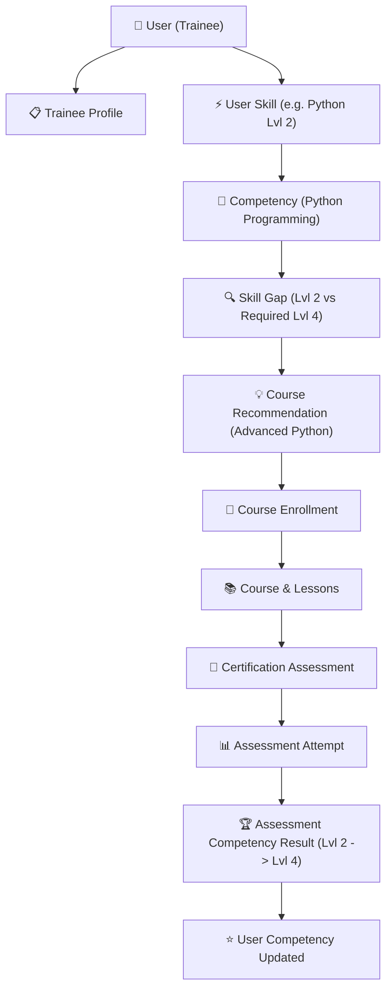

# 🗄️ Capacity Connect — Database Architecture & Specification

## 1. Executive Summary

**Capacity Connect** is an enterprise Digital Capacity Building and Learning Management Portal designed for organizational training, competency development, skill-gap analysis, trainer matching, AI-ready recommendations, and organizational analytics.

The database is built on **PostgreSQL** (hosted on **Neon Database** with connection pooling & direct migration support) and modeled strictly through **Prisma ORM** as the unified source of truth.

---

## 2. Architectural Principles

1. **Domain-Centric Normalization**: The database represents core business entities, relationships, and lifecycles without arbitrary UI coupling.
2. **Multi-Tenant Foundation**: Key resources belong to an `Organization` (`organizationId`) and optionally a `Department` (`departmentId`), ensuring organizational data isolation.
3. **Enterprise Security & Auditability**:
   - Primary IDs use standard **UUID** format.
   - Passwords are never stored in plaintext (bcrypt salted hashes).
   - Refresh tokens are hashed (`tokenHash`) with IP/User-Agent tracking.
   - Critical governance actions (approvals, status modifications, role adjustments) are recorded in `AuditLog` with structured `oldValues` and `newValues` JSONB tracking.
4. **Delete & Cascade Governance**:
   - Private child entities (e.g. `TraineeProfile`, `Lesson`, `CourseModule`, `RolePermissionMapping`, `QuestionOption`) use `onDelete: Cascade`.
   - Historical records (e.g. `AuditLog`, `AssessmentAttempt`, `CertificateVerification`, `User` as author/trainer) use `onDelete: Restrict` or `onDelete: SetNull` to prevent data loss or historical corruption.
5. **PostgreSQL Native Typing & Enums**: Enums are enforced at the database level for states, roles, categories, and sources.

---

## 3. Database Domain Breakdown

The database is partitioned into 17 logical modules comprising **32 relational models**:

| # | Domain Module | Models | Key Functionality |
| :- | :--- | :--- | :--- |
| **1** | **Organization & Tenant** | `Organization`, `Department` | Multi-tenancy, departmental structure, organizational branding |
| **2** | **Identity & Users** | `User`, `TraineeProfile`, `TrainerProfile` | Core user identity, contact details, specialized persona metadata |
| **3** | **RBAC Governance** | `AppRole`, `AppPermission`, `RolePermissionMapping` | Dynamic role-permission matrix with granular capability checks |
| **4** | **Session & Audit** | `RefreshToken`, `AuditLog` | Hashed refresh tokens, IP tracking, immutable audit trails |
| **5** | **Skills & Expertise** | `Skill`, `UserSkill`, `TrainerExpertise` | Canonical skill taxonomy, proficiency levels (1-5), trainer expertise |
| **6** | **Credentials & Experience** | `Qualification`, `WorkExperience`, `Certificate`, `CertificateVerification` | Formal degrees, employment history, verifiable professional credentials |
| **7** | **Curriculum & Courses** | `Course`, `CourseModule`, `Lesson`, `CoursePrerequisite` | Structured modules, lesson types (Video, PDF, Quiz, Article), DAG prerequisites |
| **8** | **Enrollment & Tracking** | `Enrollment`, `LessonProgress` | Granular progress percentage, started/completed timestamps |
| **9** | **Learning Resources** | `Resource`, `CourseResource`, `LessonResource` | Media repository (Storage agnostic: S3/Disk/Cloud), multi-attach |
| **10** | **Assessments** | `Assessment`, `AssessmentQuestion`, `QuestionOption` | MCQs, questionnaires, timed tests, passing score thresholds |
| **11** | **Testing & Attempts** | `AssessmentAttempt`, `AssessmentAnswer` | Real-time attempt capture, automated scoring, answer logs |
| **12** | **Competency Framework** | `Competency`, `CompetencyLevel`, `CourseCompetency` | 6-tier competency scale (0=Not Assessed to 5=Expert), target mappings |
| **13** | **Competency Tracking** | `UserCompetency`, `AssessmentCompetencyResult` | Dynamic competency scoring linked to assessments and profile verification |
| **14** | **Skill Gap Engine** | `SkillGap` | Gap calculation (`requiredLevel - currentLevel`), priority tiers (Low to Critical) |
| **15** | **Recommendations & Matching**| `Recommendation`, `TrainerMatch` | Rule-engine & AI-ready course/trainer recommendations |
| **16** | **Feedback & Community** | `Feedback`, `Announcement` | Star ratings, moderated reviews, targeted organization announcements |
| **17** | **Notifications & Rewards** | `Notification`, `Achievement` | Real-time alerts, milestone badges, gamified skill achievements |

---

## 4. End-to-End Business Flow



---

## 5. Indexing & Unique Constraints

### Unique Constraints
* `Organization.code`
* `Department(organizationId, code)`
* `User.email`
* `AppRole.name`, `AppPermission.name`, `RolePermissionMapping(roleId, permissionId)`
* `RefreshToken.tokenHash`
* `TraineeProfile.userId`, `TrainerProfile.userId`
* `Skill.code`, `UserSkill(userId, skillId)`, `TrainerExpertise(trainerId, skillId)`
* `Course.slug`, `CoursePrerequisite(courseId, prerequisiteCourseId)`
* `Enrollment(userId, courseId)`, `LessonProgress(userId, lessonId)`
* `CourseResource(courseId, resourceId)`, `LessonResource(lessonId, resourceId)`
* `Competency.code`, `CompetencyLevel(competencyId, level)`
* `CourseCompetency(courseId, competencyId)`
* `UserCompetency(userId, competencyId)`
* `SkillGap(userId, competencyId)`

### Indexing Strategy
* **Lookup performance**: Indexes placed on all foreign keys (`organizationId`, `userId`, `courseId`, `trainerId`, `departmentId`, `competencyId`).
* **Filtering & Statuses**: Indexes on `status`, `role`, `priority`, `isRead`, `verificationStatus`.
* **Ordering & Chronology**: Indexes on `orderIndex` and `createdAt` for audit logs and paginated listings.

---

## 6. Neon PostgreSQL & Migration Configuration

* **Connection Pooling**: `DATABASE_URL` connects to Neon's PgBouncer pooler for efficient connection scaling in serverless/Node environments.
* **Direct Migration Connection**: `DIRECT_URL` bypasses pooling for schema migrations (`prisma migrate dev` / `prisma migrate deploy`).

```prisma
datasource db {
  provider  = "postgresql"
  url       = env("DATABASE_URL")
  directUrl = env("DIRECT_URL")
}
```

---

## 7. Migration & Seeding Verification

* **Migration Applied**: `20260902152535_init_capacity_connect`
* **Prisma Client**: Generated (v5.22.0)
* **Seed Execution**: Verified via `npx prisma db seed` with realistic test accounts, competencies, courses, assessments, and recommendations.
