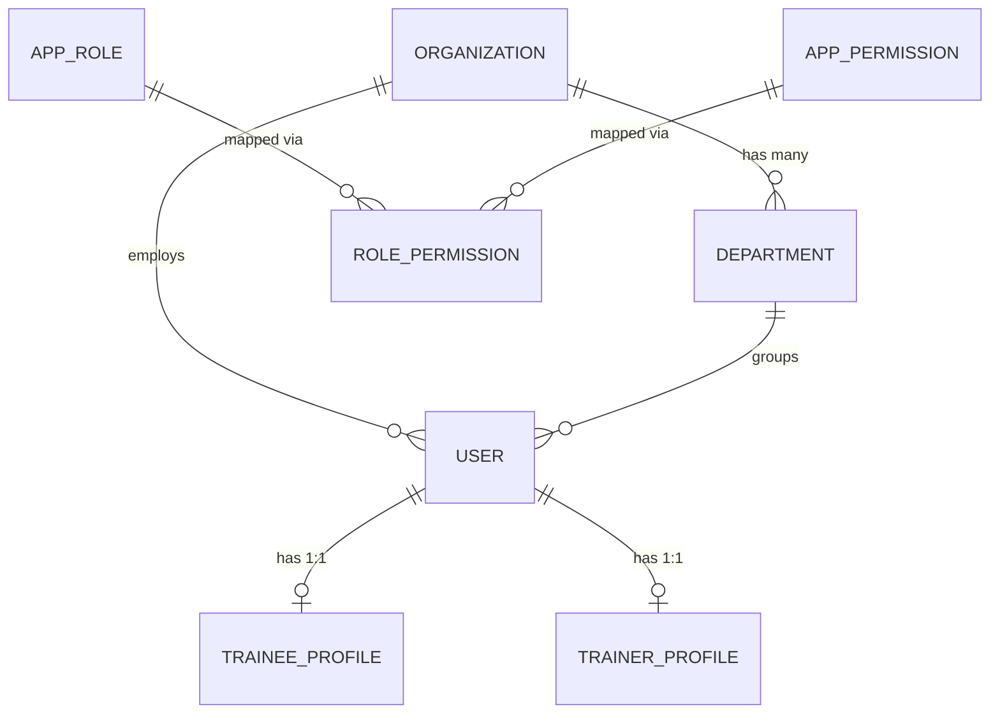

# 👤 Step 1: Identity, Organization & Access Control

## 1. Overview in Plain English
This module is the **front door and foundation** of the application. It manages:
* **Multi-Tenancy**: Organizations (companies, universities, or institutions) and their internal Departments.
* **User Accounts**: Login credentials, contact info, and account status (e.g. Approved vs Pending).
* **Personas**: Tailored profile info for learners (**Trainees**) vs instructors (**Trainers**).
* **Role-Based Access Control (RBAC)**: Fine-grained permissions controlling who can view, edit, or approve content.

---

## 2. Visual Relationship Diagram



---

## 3. Tables & Field Details

### Table: `organizations`
Represents an enterprise tenant. All courses, users, and resources are grouped under an organization.

| Column | Type | Description | Example |
| :--- | :--- | :--- | :--- |
| `id` | UUID (PK) | Unique organization ID | `9b1deb4d-3b7d-4bad...` |
| `name` | String | Company or institution name | `Acme Corp Learning Academy` |
| `code` | String (Unique) | Short organizational code | `ACME-CORP` |
| `description` | String (Nullable) | Brief summary of the org | `Global technology training division` |
| `logoUrl` | String (Nullable) | URL to company logo | `https://cdn.example.com/logo.png` |
| `status` | Enum | `ACTIVE`, `INACTIVE`, `SUSPENDED` | `ACTIVE` |

* **Delete Behavior**: When an Organization is deleted, all its `departments` are deleted (`Cascade`). Users and Courses are protected (`Restrict`) to prevent accidental data loss.

---

### Table: `departments`
Internal business units or divisions within an organization.

| Column | Type | Description | Example |
| :--- | :--- | :--- | :--- |
| `id` | UUID (PK) | Unique department ID | `e4b3c2a1-...` |
| `organizationId` | UUID (FK) | Links to parent `organizations.id` | `9b1deb4d-...` |
| `name` | String | Department title | `Technology & Engineering` |
| `code` | String | Department code within org | `TECH` |
| `description` | String (Nullable) | Scope of work | `Software, DevOps & Data Teams` |

* **Relationship**: `Organization (1) -> Departments (N)`. A department code is unique inside its organization (`@@unique([organizationId, code])`).

---

### Table: `users`
The central login and identity record.

| Column | Type | Description | Example |
| :--- | :--- | :--- | :--- |
| `id` | UUID (PK) | Unique user ID | `a1b2c3d4-...` |
| `organizationId` | UUID (FK) | Organization the user belongs to | `9b1deb4d-...` |
| `departmentId` | UUID (FK, Nullable)| Department the user belongs to | `e4b3c2a1-...` |
| `email` | String (Unique) | Login email address | `jane.doe@enterprise.com` |
| `passwordHash` | String | Salted bcrypt hash (never plaintext) | `$2a$10$e8wF...` |
| `firstName` | String | User's first name | `Jane` |
| `lastName` | String (Nullable) | User's last name | `Doe` |
| `role` | Enum | `SUPER_ADMIN`, `ADMIN`, `TRAINER`, `TRAINEE` | `TRAINEE` |
| `status` | Enum | `PENDING`, `APPROVED`, `REJECTED`, `SUSPENDED` | `APPROVED` |
| `emailVerified` | Boolean | Whether email was confirmed | `true` |
| `lastLoginAt` | DateTime (Nullable)| Timestamp of last login | `2026-09-02T18:30:00Z` |

---

### Table: `trainee_profiles` (1:1 with User)
Holds information specific to learners.

| Column | Type | Description | Example |
| :--- | :--- | :--- | :--- |
| `id` | UUID (PK) | Unique profile ID | `f5e4d3c2-...` |
| `userId` | UUID (FK, Unique) | Links to `users.id` | `a1b2c3d4-...` |
| `designation` | String (Nullable) | Current job title / role | `Junior Software Engineer` |
| `bio` | String (Nullable) | Personal goals & background | `Passionate about backend systems` |
| `interests` | String[] | Topics of interest | `['Python', 'SQL', 'Cloud']` |
| `profileCompletion`| Int (0-100) | Profile completeness score | `85` |

---

### Table: `trainer_profiles` (1:1 with User)
Holds information specific to instructors and course authors.

| Column | Type | Description | Example |
| :--- | :--- | :--- | :--- |
| `id` | UUID (PK) | Unique trainer profile ID | `c9b8a7f6-...` |
| `userId` | UUID (FK, Unique) | Links to `users.id` | `b2c3d4e5-...` |
| `designation` | String | Instructor title | `Principal AI & Cloud Architect` |
| `organizationName` | String (Nullable) | Employer / Consulting Agency | `Tech Training Labs` |
| `bio` | String | Teaching background | `10+ years teaching Python and AWS` |
| `yearsExperience` | Int | Years of professional experience | `12` |

---

### Tables: `roles`, `permissions`, and `role_permissions`
Provides a dynamic, database-driven permissions system:
* **`roles`**: Defines named roles (`SUPER_ADMIN`, `ADMIN`, `TRAINER`, `TRAINEE`).
* **`permissions`**: Defines granular capabilities (e.g. `users:write`, `courses:approve`, `assessments:create`).
* **`role_permissions`**: Many-to-Many bridge table connecting roles with granted permissions.

---

## 4. Step-by-Step Practical Workflow

```
1. Admin creates Organization ("Acme Corp") and Departments ("Tech", "HR").
2. Trainee signs up -> A new row in `users` is created with status "PENDING".
3. Admin approves user -> status changes to "APPROVED" and an AuditLog is recorded.
4. Trainee fills in personal bio and interests -> Saved in `trainee_profiles`.
5. Trainer signs up -> `trainer_profiles` captures teaching credentials and years of experience.
```
