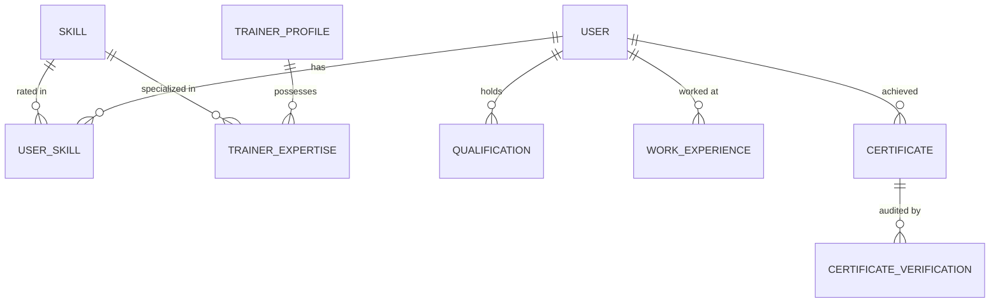

# ⚡ Step 2: Skills, Qualifications & Certifications

## 1. Overview in Plain English
This module tracks **what people know and what credentials they hold**:
* **Skill Taxonomy**: A master list of all organizational skills (e.g., Python, SQL, Cloud Architecture, Communication).
* **User Skills**: What skills a trainee has and their current proficiency level (1 to 5).
* **Trainer Expertise**: What skills an instructor is qualified to teach.
* **Credentials**: Educational degrees (`qualifications`), past jobs (`work_experiences`), and industry certificates (`certificates` + `certificate_verifications`).

---

## 2. Visual Relationship Diagram



---

## 3. Tables & Field Details

### Table: `skills`
The master catalog of technical and soft skills.

| Column | Type | Description | Example |
| :--- | :--- | :--- | :--- |
| `id` | UUID (PK) | Unique skill ID | `d1e2f3a4-...` |
| `name` | String | Skill display name | `Python & Async Programming` |
| `code` | String (Unique) | Canonical skill code | `SKILL-PY` |
| `category` | String (Nullable) | Subject category | `Software Engineering` |
| `description` | String (Nullable) | Overview of what this skill entails | `Object-oriented and concurrent Python` |

---

### Table: `user_skills`
Connects a **Trainee** to a **Skill** and records their proficiency.

| Column | Type | Description | Example |
| :--- | :--- | :--- | :--- |
| `id` | UUID (PK) | Unique user-skill ID | `u1s2k3-...` |
| `userId` | UUID (FK) | Links to `users.id` | `a1b2c3d4-...` |
| `skillId` | UUID (FK) | Links to `skills.id` | `d1e2f3a4-...` |
| `proficiencyLevel` | Int (1 to 5) | 1=Novice, 2=Basic, 3=Intermediate, 4=Advanced, 5=Expert | `2` |
| `yearsExperience` | Int (Nullable) | Years practicing this skill | `1` |
| `source` | Enum | `PROFILE`, `ASSESSMENT`, `COURSE_COMPLETION`, `CERTIFICATE`, `AI_ANALYSIS` | `PROFILE` |

* **Unique Rule**: A user cannot have duplicate entries for the same skill (`@@unique([userId, skillId])`).

---

### Table: `trainer_expertise`
Connects a **Trainer** to a **Skill** that they are certified to teach.

| Column | Type | Description | Example |
| :--- | :--- | :--- | :--- |
| `id` | UUID (PK) | Unique record ID | `t1e2x3-...` |
| `trainerId` | UUID (FK) | Links to `trainer_profiles.id` | `c9b8a7f6-...` |
| `skillId` | UUID (FK) | Links to `skills.id` | `d1e2f3a4-...` |
| `proficiencyLevel` | Int (1 to 5) | Instructor's mastery rating | `5` |
| `yearsExperience` | Int (Nullable) | Years instructing or using skill | `10` |

---

### Table: `qualifications`
Formal academic degrees or diplomas held by a user.

| Column | Type | Description | Example |
| :--- | :--- | :--- | :--- |
| `id` | UUID (PK) | Unique qualification ID | `q1a2b3-...` |
| `userId` | UUID (FK) | Links to `users.id` | `a1b2c3d4-...` |
| `degree` | String | Degree title | `Bachelor of Science` |
| `fieldOfStudy` | String | Academic major | `Computer Science` |
| `institution` | String | University or college name | `Stanford University` |
| `startDate`, `endDate` | DateTime (Nullable) | Timeframe | `2018-09-01` to `2022-06-01` |

---

### Table: `work_experiences`
Past or current professional jobs.

| Column | Type | Description | Example |
| :--- | :--- | :--- | :--- |
| `id` | UUID (PK) | Unique job record ID | `w1e2x3-...` |
| `userId` | UUID (FK) | Links to `users.id` | `a1b2c3d4-...` |
| `companyName` | String | Employer name | `Google` |
| `jobTitle` | String | Position held | `Software Engineer` |
| `isCurrent` | Boolean | Whether currently employed here | `false` |
| `startDate`, `endDate` | DateTime | Employment period | `2022-07-01` to `2024-08-01` |

---

### Tables: `certificates` & `certificate_verifications`
Tracks external credentials (e.g. AWS, Microsoft, Cisco certifications) and their audit trail.
* **`certificates`**: Stores certificate title, issuing organization, credential ID, issue date, and expiration date.
* **`certificate_verifications`**: Stores how the certificate was verified (e.g., automated API verification, manual admin review, or blockchain hash).

---

## 4. Step-by-Step Practical Workflow

```
1. Admin adds "Python" (SKILL-PY) and "PostgreSQL" (SKILL-SQL) to the master `skills` table.
2. Trainee registers and adds "Python" (Proficiency: 2/5, Source: PROFILE) into `user_skills`.
3. Trainer Alex creates a profile and lists "Python" (Proficiency: 5/5, Experience: 10 yrs) in `trainer_expertise`.
4. Trainee uploads their "AWS Cloud Practitioner" PDF -> saved in `certificates` with status "PENDING".
5. Admin verifies the badge URL -> `certificate_verifications` logs the verified timestamp and changes certificate status to "VERIFIED".
```
