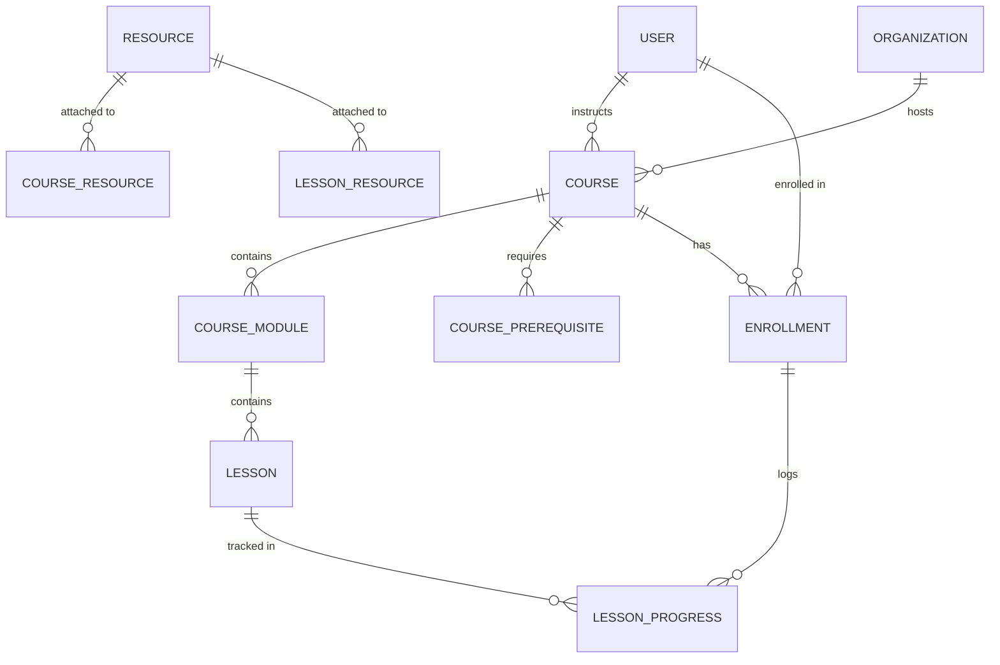

# 📚 Step 3: Courses, Curriculum & Learning Resources

## 1. Overview in Plain English
This module handles **everything related to learning content and trainee participation**:
* **Course Structure**: Courses $\rightarrow$ broken into sequential Modules $\rightarrow$ containing individual Lessons.
* **Content Types**: Lessons can be video streams, PDF readings, articles, quizzes, or interactive links.
* **Prerequisites**: A course can require other courses to be completed first (e.g. *Advanced Python* requires *Python Fundamentals*).
* **Trainee Enrollment & Progress**: Tracks who is enrolled in what, how many lessons they have finished, and their total completion percentage (0% to 100%).
* **Media Assets (`resources`)**: Cloud/local files (PDFs, slide decks, diagrams) that can be attached to courses and lessons.

---

## 2. Visual Relationship Diagram



---

## 3. Tables & Field Details

### Table: `courses`
The core course catalog item.

| Column | Type | Description | Example |
| :--- | :--- | :--- | :--- |
| `id` | UUID (PK) | Unique course ID | `c1a2b3c4-...` |
| `organizationId` | UUID (FK) | Links to `organizations.id` | `9b1deb4d-...` |
| `trainerId` | UUID (FK) | Instructor who authored the course (`users.id`) | `b2c3d4e5-...` |
| `title` | String | Course title | `Python Fundamentals & OOP` |
| `slug` | String (Unique) | URL-friendly slug | `python-fundamentals-oop` |
| `description` | String | Full course syllabus overview | `Master core Python, OOP, and data structures` |
| `category` | String | Subject area | `Software Engineering` |
| `difficulty` | Enum | `BEGINNER`, `INTERMEDIATE`, `ADVANCED`, `EXPERT` | `BEGINNER` |
| `durationMinutes` | Int | Estimated duration in minutes | `180` (3 hours) |
| `status` | Enum | `DRAFT`, `PENDING_APPROVAL`, `PUBLISHED`, `ARCHIVED` | `PUBLISHED` |

---

### Table: `course_modules`
Sequential chapters within a course.

| Column | Type | Description | Example |
| :--- | :--- | :--- | :--- |
| `id` | UUID (PK) | Unique module ID | `m1a2b3-...` |
| `courseId` | UUID (FK) | Links to `courses.id` (`onDelete: Cascade`) | `c1a2b3c4-...` |
| `title` | String | Chapter name | `Module 1: Language Syntax & Control Flow` |
| `orderIndex` | Int | Sorting order (1, 2, 3...) | `1` |

---

### Table: `lessons`
Individual bite-sized lessons within a module.

| Column | Type | Description | Example |
| :--- | :--- | :--- | :--- |
| `id` | UUID (PK) | Unique lesson ID | `l1a2b3-...` |
| `moduleId` | UUID (FK) | Links to `course_modules.id` (`onDelete: Cascade`) | `m1a2b3-...` |
| `title` | String | Lesson title | `Introduction & Python Environment` |
| `contentType` | Enum | `VIDEO`, `PDF`, `ARTICLE`, `QUIZ`, `LINK`, `DOCUMENT` | `VIDEO` |
| `content` | String (Nullable) | Markdown instructions / notes | `# Getting Started\nDownload Python 3.12...` |
| `resourceUrl` | String (Nullable) | Media URL | `https://stream.example.com/videos/py-intro.mp4` |
| `durationMinutes` | Int (Nullable) | Estimated length | `20` |
| `orderIndex` | Int | Lesson order in module | `1` |
| `isPreview` | Boolean | If true, can be viewed without enrollment | `true` |

---

### Table: `course_prerequisites`
Allows courses to require other courses as prerequisites before enrolling.

| Column | Type | Description | Example |
| :--- | :--- | :--- | :--- |
| `courseId` | UUID (PK, FK) | The course that has a requirement | *Advanced Python* (`c2...`) |
| `prerequisiteCourseId` | UUID (PK, FK) | The required prerequisite course | *Python Fundamentals* (`c1...`) |

---

### Table: `enrollments` & `lesson_progress`
Tracks a learner's live progress through a course.
* **`enrollments`**:
  * Records `userId`, `courseId`, `status` (`ENROLLED`, `IN_PROGRESS`, `COMPLETED`, `DROPPED`), and overall `progressPercentage` (e.g. `50.0%`).
* **`lesson_progress`**:
  * Tracks each specific lesson completion (`completed: true`, `progressPercentage: 100%`, `completedAt: timestamp`).

---

### Tables: `resources`, `course_resources`, and `lesson_resources`
Cloud-ready file repository (PDF handbooks, cheat sheets, exercise zip files).
* **`resources`**: Stores file metadata, title, `storageKey` (e.g. S3 path), `mimeType`, and file size.
* **`course_resources` & `lesson_resources`**: Attach files to specific courses or lessons.

---

## 4. Step-by-Step Practical Workflow

```
1. Trainer Alex creates a new Course ("Python Fundamentals") with 2 Modules and 4 Lessons.
2. Alex submits the course for review -> Status becomes "PENDING_APPROVAL".
3. Admin Sarah reviews the content and approves it -> Status becomes "PUBLISHED".
4. Trainee Jane enrolls -> A row is created in `enrollments` (Status: "IN_PROGRESS", Progress: 0%).
5. Jane completes Lesson 1 -> A row is inserted in `lesson_progress` (completed: true), and enrollment progress updates to 25%.
6. Once all 4 lessons are completed -> `enrollments.progressPercentage` reaches 100% and status updates to "COMPLETED".
```
