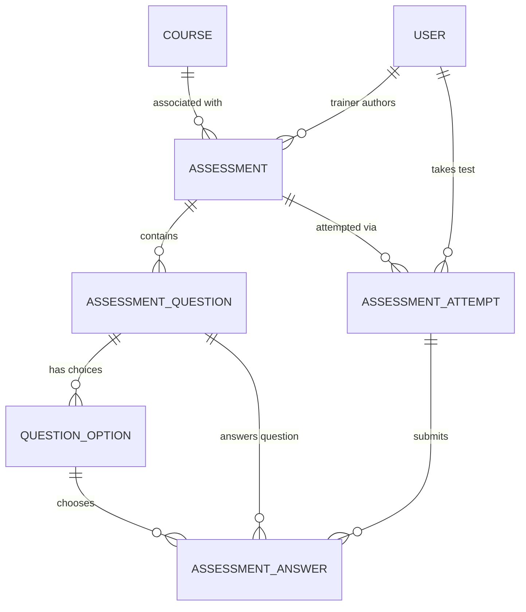

# 📝 Step 4: Assessments, Quizzes & Testing

## 1. Overview in Plain English
This module handles **testing and knowledge verification**:
* **Assessments**: Quizzes, mid-term exams, or final certification tests created by trainers.
* **Question Banks**: Multiple-choice (Single selection, Multiple selection) and True/False questions with points/marks.
* **Options**: Selectable answer choices with marked correct answers (`isCorrect: true`).
* **Attempts**: A timed session when a trainee starts and submits an assessment.
* **Answers**: The exact option the trainee selected, automated correctness check (`isCorrect`), and marks awarded.

---

## 2. Visual Relationship Diagram



---

## 3. Tables & Field Details

### Table: `assessments`
The exam or quiz definition.

| Column | Type | Description | Example |
| :--- | :--- | :--- | :--- |
| `id` | UUID (PK) | Unique assessment ID | `a1e2x3-...` |
| `courseId` | UUID (FK, Nullable)| Optional parent course | `c1a2b3c4-...` |
| `trainerId` | UUID (FK) | Authoring trainer (`users.id`) | `b2c3d4e5-...` |
| `title` | String | Exam name | `Python Fundamentals Certification Test` |
| `subject` | String | Topic tested | `Python Programming & OOP` |
| `assessmentType` | Enum | `MCQ`, `QUESTIONNAIRE`, `PRACTICAL`, `SURVEY` | `MCQ` |
| `durationMinutes` | Int (Nullable) | Time limit (e.g. 45 mins) | `45` |
| `passingScore` | Float | Percentage needed to pass (e.g. 70%) | `70.0` |
| `status` | Enum | `DRAFT`, `PUBLISHED`, `CLOSED`, `ARCHIVED` | `PUBLISHED` |

---

### Table: `assessment_questions`
Questions inside an assessment.

| Column | Type | Description | Example |
| :--- | :--- | :--- | :--- |
| `id` | UUID (PK) | Unique question ID | `q1u2e3-...` |
| `assessmentId` | UUID (FK) | Links to `assessments.id` (`onDelete: Cascade`) | `a1e2x3-...` |
| `questionText` | String | The actual problem statement | `What is the average lookup time in a Python dict?` |
| `questionType` | Enum | `SINGLE_CHOICE`, `MULTIPLE_CHOICE`, `TRUE_FALSE` | `SINGLE_CHOICE` |
| `marks` | Float | Score value of this question | `10.0` |
| `orderIndex` | Int | Question number (1, 2, 3...) | `1` |
| `explanation` | String (Nullable) | Review note shown after submission | `Python dicts use hash tables -> O(1) average.` |

---

### Table: `question_options`
Choices available for a question.

| Column | Type | Description | Example |
| :--- | :--- | :--- | :--- |
| `id` | UUID (PK) | Unique option ID | `o1p2t3-...` |
| `questionId` | UUID (FK) | Links to `assessment_questions.id` (`onDelete: Cascade`) | `q1u2e3-...` |
| `optionText` | String | Option label | `O(1) average` |
| `isCorrect` | Boolean | If true, this is the correct answer | `true` |
| `orderIndex` | Int | Display sequence (A, B, C, D) | `1` |

---

### Table: `assessment_attempts`
A trainee's test-taking session.

| Column | Type | Description | Example |
| :--- | :--- | :--- | :--- |
| `id` | UUID (PK) | Unique attempt ID | `a1t2t3-...` |
| `assessmentId` | UUID (FK) | Links to `assessments.id` | `a1e2x3-...` |
| `userId` | UUID (FK) | Links to `users.id` (`onDelete: Cascade`) | `a1b2c3d4-...` |
| `startedAt` | DateTime | Timestamp when test started | `2026-09-02T19:00:00Z` |
| `submittedAt` | DateTime (Nullable)| Timestamp when submitted | `2026-09-02T19:30:00Z` |
| `score` | Float (Nullable) | Total points scored | `20.0` / 20.0 |
| `percentage` | Float (Nullable) | Computed percentage | `100.0`% |
| `passed` | Boolean (Nullable) | Whether percentage >= passingScore | `true` |
| `timeTakenSeconds` | Int (Nullable) | Actual duration taken in seconds | `1800` (30 mins) |
| `status` | Enum | `IN_PROGRESS`, `SUBMITTED`, `EXPIRED`, `ABANDONED` | `SUBMITTED` |

---

### Table: `assessment_answers`
Stores every answer submitted by the trainee.

| Column | Type | Description | Example |
| :--- | :--- | :--- | :--- |
| `id` | UUID (PK) | Unique answer record ID | `a1n2s3-...` |
| `attemptId` | UUID (FK) | Links to `assessment_attempts.id` (`onDelete: Cascade`)| `a1t2t3-...` |
| `questionId` | UUID (FK) | Links to `assessment_questions.id` | `q1u2e3-...` |
| `selectedOptionId` | UUID (FK, Nullable)| The option chosen by the user | `o1p2t3-...` |
| `isCorrect` | Boolean (Nullable) | Automated grading result | `true` |
| `marksObtained` | Float (Nullable) | Points awarded for this answer | `10.0` |

---

## 4. Step-by-Step Practical Workflow

```
1. Trainer Alex creates "Python Certification Test" (Passing score: 70%, Time limit: 45m).
2. Alex adds 2 questions with 4 options each, marking the correct option for each question.
3. Trainee Jane clicks "Start Assessment" -> A row is inserted in `assessment_attempts` (status: "IN_PROGRESS").
4. Jane answers Question 1 by selecting Option A -> An `assessment_answers` record is logged.
5. Jane clicks "Submit" -> The server calculates total marks (20/20 = 100%), sets passed: true, and marks the attempt as "SUBMITTED".
6. (Next step): The passing attempt automatically feeds into the Competency Engine (Step 5)!
```
