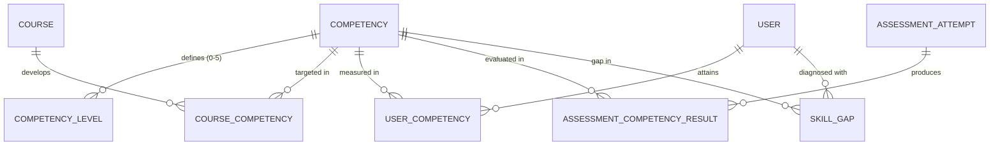

# 🎯 Step 5: Competencies & Skill-Gap Analysis

## 1. Overview in Plain English
This module is the **intelligent brain** of Capacity Connect:
* **Competencies**: High-level organizational capability standards (e.g. *Python Programming*, *Database Management*, *Cloud Architecture*).
* **6-Tier Level Scale**: Standardized capability scale from Level 0 (*Not Assessed*) to Level 5 (*Industry Expert*).
* **Course Mapping**: Tells the system what competency level a course will train a student to reach.
* **Assessment Results**: When a trainee passes a test, this module calculates what competency level they just earned.
* **Skill Gap Analysis**: Compares a trainee's current level against their role target and calculates the exact gap (e.g., Current: Level 2, Required: Level 4 $\rightarrow$ Gap: 2).

---

## 2. Visual Relationship Diagram



---

## 3. The Standard 6-Tier Competency Scale

| Tier Level | Level Name | Semantic Meaning |
| :---: | :--- | :--- |
| **0** | `NOT_ASSESSED` | No test or evaluation has been taken yet |
| **1** | `BEGINNER` | Understands basic concepts with guided supervision |
| **2** | `BASIC` | Can perform standard, routine tasks independently |
| **3** | `INTERMEDIATE` | Can solve complex technical problems and optimize code |
| **4** | `ADVANCED` | System design, architecture, and team technical leadership |
| **5** | `EXPERT` | Industry authority, strategic design, and innovation |

---

## 4. Tables & Field Details

### Table: `competencies`
The master catalog of competencies.

| Column | Type | Description | Example |
| :--- | :--- | :--- | :--- |
| `id` | UUID (PK) | Unique competency ID | `c1p2y3-...` |
| `name` | String | Competency name | `Python Programming` |
| `code` | String (Unique) | Code identifier | `COMP-PY-PROG` |
| `category` | String (Nullable) | Category | `Software Engineering` |
| `description` | String (Nullable) | Overview | `End-to-end Python system design and coding` |

---

### Table: `competency_levels`
Defines the specific criteria for each level (0 through 5) of a competency.

| Column | Type | Description | Example |
| :--- | :--- | :--- | :--- |
| `id` | UUID (PK) | Unique level ID | `l1v2l3-...` |
| `competencyId` | UUID (FK) | Links to `competencies.id` (`onDelete: Cascade`) | `c1p2y3-...` |
| `level` | Int (0 to 5) | Tier index | `2` |
| `name` | String | Level name | `BASIC` |
| `description` | String (Nullable) | Requirement details | `Can build scripts and handle routine OOP tasks` |

* **Unique Rule**: `@@unique([competencyId, level])`.

---

### Table: `course_competencies`
Maps which competency a course develops and what level it targets.

| Column | Type | Description | Example |
| :--- | :--- | :--- | :--- |
| `id` | UUID (PK) | Unique mapping ID | `c1c2m3-...` |
| `courseId` | UUID (FK) | Links to `courses.id` (`onDelete: Cascade`) | `c1a2b3c4-...` (*Python Fundamentals*) |
| `competencyId` | UUID (FK) | Links to `competencies.id` | `c1p2y3-...` (*Python Programming*) |
| `targetLevel` | Int (1 to 5) | Target level achieved upon course completion | `2` (Basic) |

---

### Table: `user_competencies`
Records the verified capability level for an individual learner.

| Column | Type | Description | Example |
| :--- | :--- | :--- | :--- |
| `id` | UUID (PK) | Unique record ID | `u1c2m3-...` |
| `userId` | UUID (FK) | Links to `users.id` (`onDelete: Cascade`) | `a1b2c3d4-...` (Jane) |
| `competencyId` | UUID (FK) | Links to `competencies.id` | `c1p2y3-...` (*Python Programming*) |
| `currentLevel` | Int (0 to 5) | Current verified level | `2` |
| `confidenceScore`| Float (Nullable) | Score confidence | `0.95` (95%) |
| `lastAssessedAt` | DateTime (Nullable)| When last verified | `2026-09-02T19:30:00Z` |
| `source` | Enum | `ASSESSMENT`, `COURSE_COMPLETION`, `PROFILE` | `ASSESSMENT` |

---

### Table: `assessment_competency_results`
Direct bridge between test attempts and competency achievements.

| Column | Type | Description | Example |
| :--- | :--- | :--- | :--- |
| `id` | UUID (PK) | Unique record ID | `a1c2r3-...` |
| `attemptId` | UUID (FK) | Links to `assessment_attempts.id` (`onDelete: Cascade`)| `a1t2t3-...` |
| `competencyId` | UUID (FK) | Links to `competencies.id` | `c1p2y3-...` |
| `score` | Float | Score percentage achieved in test | `100.0`% |
| `levelAchieved` | Int (1 to 5) | Competency tier unlocked | `2` |

---

### Table: `skill_gaps`
The diagnosed skill deficit for a trainee.

| Column | Type | Description | Example |
| :--- | :--- | :--- | :--- |
| `id` | UUID (PK) | Unique gap ID | `s1g2a3-...` |
| `userId` | UUID (FK) | Links to `users.id` (`onDelete: Cascade`) | `a1b2c3d4-...` (Jane) |
| `competencyId` | UUID (FK) | Links to `competencies.id` | `c1p2y3-...` (*Python Programming*) |
| `currentLevel` | Int | What the trainee currently has | `2` |
| `requiredLevel` | Int | What the role/job target demands | `4` |
| `gapLevel` | Int | `requiredLevel - currentLevel` | `2` |
| `priority` | Enum | `LOW`, `MEDIUM`, `HIGH`, `CRITICAL` | `HIGH` |
| `status` | Enum | `OPEN`, `IN_PROGRESS`, `RESOLVED` | `OPEN` |

---

## 5. Step-by-Step Practical Workflow

```
1. Admin configures Competency "Python Programming" with Levels 0 to 5.
2. Trainee Jane takes an assessment and scores 100% -> An `assessment_competency_results` is created (Level 2).
3. Jane's `user_competencies` record is updated to Level 2.
4. Organization role requirement states that Senior Engineers need Level 4.
5. System diagnoses a gap: Current=2, Required=4 -> Inserts a `skill_gaps` record (Gap=2, Priority="HIGH").
6. The Recommendation Engine automatically picks up this gap to suggest Level 4 courses!
```
