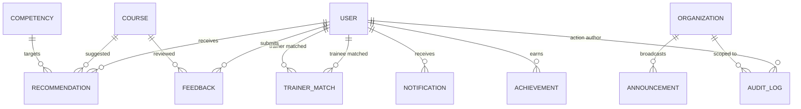

# 💡 Step 6: Recommendations, Matching, Engagement & Audit

## 1. Overview in Plain English
This module handles **intelligent matching, community interaction, and security auditing**:
* **Smart Recommendations**: Suggests specific courses or learning paths to close open skill gaps.
* **Trainer Matching**: Calculates compatibility scores between trainees and specialized instructors.
* **Feedback & Reviews**: 1 to 5-star ratings and written reviews for courses, trainers, and tests.
* **Announcements & Notifications**: Organization-wide news banners and individual real-time notification alerts.
* **Gamified Achievements**: Unlocks milestone badges (e.g., *Foundation Explorer*, *Assessment Ace*).
* **Audit Logs & Sessions**: Immutable security records tracking administrative changes and secure hashed token sessions.

---

## 2. Visual Relationship Diagram



---

## 3. Tables & Field Details

### Table: `recommendations`
Smart suggestions generated for a trainee.

| Column | Type | Description | Example |
| :--- | :--- | :--- | :--- |
| `id` | UUID (PK) | Unique recommendation ID | `r1e2c3-...` |
| `userId` | UUID (FK) | Target trainee (`users.id`) | `a1b2c3d4-...` (Jane) |
| `recommendationType`| Enum | `COURSE`, `TRAINER`, `RESOURCE`, `LEARNING_PATH` | `COURSE` |
| `courseId` | UUID (FK, Nullable)| Recommended course | `c2a3b4-...` (*Advanced Python*) |
| `competencyId` | UUID (FK, Nullable)| Target competency | `c1p2y3-...` (*Python Programming*) |
| `score` | Float (Nullable) | Match confidence (0.0 to 1.0) | `0.92` (92%) |
| `reason` | String (Nullable) | Human-readable explanation | `Recommended based on Python gap (Level 4 target)` |
| `source` | Enum | `RULE_ENGINE`, `AI`, `ADMIN` | `RULE_ENGINE` |
| `status` | Enum | `ACTIVE`, `VIEWED`, `ACCEPTED`, `DISMISSED`, `EXPIRED` | `ACTIVE` |

---

### Table: `trainer_matches`
Calculates matches between learners needing mentoring and qualified trainers.

| Column | Type | Description | Example |
| :--- | :--- | :--- | :--- |
| `id` | UUID (PK) | Unique match ID | `t1m2a3-...` |
| `traineeId` | UUID (FK) | Learner (`users.id`) | `a1b2c3d4-...` (Jane) |
| `trainerId` | UUID (FK) | Expert instructor (`users.id`) | `b2c3d4e5-...` (Alex Rivers) |
| `competencyId` | UUID (FK, Nullable)| Matching subject | `c1p2y3-...` (*Python Programming*) |
| `matchScore` | Float (0 to 100) | Percentage compatibility | `94.5`% |
| `matchingSkills` | JSONB (Nullable) | List of shared technical skills | `{"skills": ["Python", "Concurrency"]}` |
| `reason` | String (Nullable) | Match rationale | `Trainer Alex has 10+ yrs in Advanced Python` |

---

### Table: `feedbacks`
Ratings and written reviews.

| Column | Type | Description | Example |
| :--- | :--- | :--- | :--- |
| `id` | UUID (PK) | Unique review ID | `f1b2c3-...` |
| `userId` | UUID (FK) | Author who wrote review | `a1b2c3d4-...` (Jane) |
| `courseId` | UUID (FK, Nullable)| Course being reviewed | `c1a2b3c4-...` |
| `trainerId` | UUID (FK, Nullable)| Trainer being reviewed | `b2c3d4e5-...` |
| `rating` | Int (1 to 5) | Star rating | `5` |
| `comment` | String (Nullable) | Written thoughts | `Exceptional course! Clear OOP architecture.` |
| `status` | Enum | `PENDING_MODERATION`, `PUBLISHED`, `HIDDEN` | `PUBLISHED` |

---

### Table: `announcements`
Broadcast notices from administrators to an entire organization.

| Column | Type | Description | Example |
| :--- | :--- | :--- | :--- |
| `id` | UUID (PK) | Unique announcement ID | `a1n2n3-...` |
| `organizationId` | UUID (FK) | Organization receiving notice | `9b1deb4d-...` |
| `createdBy` | UUID (FK) | Author administrator | `s1a2r3-...` (Sarah) |
| `title` | String | Subject headline | `Welcome to Q3 Learning Cycle` |
| `content` | String | Full markdown text | `New certifications in Python & Cloud are live!` |
| `type` | Enum | `GENERAL`, `COURSE`, `ACHIEVEMENT`, `SYSTEM` | `GENERAL` |
| `status` | Enum | `DRAFT`, `PUBLISHED`, `ARCHIVED` | `PUBLISHED` |

---

### Table: `notifications`
Real-time alerts for individual users.

| Column | Type | Description | Example |
| :--- | :--- | :--- | :--- |
| `id` | UUID (PK) | Unique notification ID | `n1o2t3-...` |
| `userId` | UUID (FK) | Recipient user | `a1b2c3d4-...` (Jane) |
| `title` | String | Alert headline | `New Course Recommendation Available` |
| `message` | String | Alert message | `Check out Advanced Python to close your skill gap.` |
| `type` | Enum | `RECOMMENDATION`, `COURSE`, `ASSESSMENT` | `RECOMMENDATION` |
| `isRead` | Boolean | Whether user opened the alert | `false` |

---

### Table: `achievements`
Gamified rewards and badges.

| Column | Type | Description | Example |
| :--- | :--- | :--- | :--- |
| `id` | UUID (PK) | Unique achievement ID | `a1c2h3-...` |
| `userId` | UUID (FK) | Awarded trainee | `a1b2c3d4-...` (Jane) |
| `title` | String | Badge name | `First Step Achiever` |
| `description` | String (Nullable) | How it was earned | `Completed your first lesson module in Python` |
| `type` | Enum | `COURSE_COMPLETION`, `SKILL_MASTERY`, `BADGE`| `COURSE_COMPLETION` |
| `metadata` | JSONB (Nullable) | Badge graphic & ID | `{"badge": "FOUNDATION_EXPLORER"}` |

---

### Table: `audit_logs`
Immutable enterprise compliance log.

| Column | Type | Description | Example |
| :--- | :--- | :--- | :--- |
| `id` | UUID (PK) | Unique audit ID | `l1o2g3-...` |
| `organizationId` | UUID (FK, Nullable)| Organization context | `9b1deb4d-...` |
| `userId` | UUID (FK, Nullable)| Who performed the action | `s1a2r3-...` (Admin) |
| `action` | String | Action verb | `COURSE_APPROVED`, `USER_REJECTED` |
| `entityType` | String | Target table | `Course` |
| `entityId` | String (Nullable) | ID of modified entity | `c1a2b3c4-...` |
| `oldValues` | JSONB (Nullable) | State before modification | `{"status": "PENDING_APPROVAL"}` |
| `newValues` | JSONB (Nullable) | State after modification | `{"status": "PUBLISHED"}` |
| `ipAddress` | String (Nullable) | Client IP address | `192.168.1.1` |
| `userAgent` | String (Nullable) | Browser user agent | `Mozilla/5.0...` |

---

## 4. Step-by-Step Practical Workflow

```
1. Trainee Jane has an open SkillGap in Python (Target: Level 4).
2. The Recommendation Engine triggers -> Creates a row in `recommendations` for "Advanced Python".
3. System triggers a `notifications` alert ("New Course Recommendation Available").
4. System matches Jane with Trainer Alex Rivers in `trainer_matches` (Score: 94.5%).
5. Jane completes the course and submits a 5-star review in `feedbacks`.
6. System awards Jane a "Skill Mastery" badge in `achievements`.
7. Admin approves new courses -> `audit_logs` records all state transitions for governance.
```
