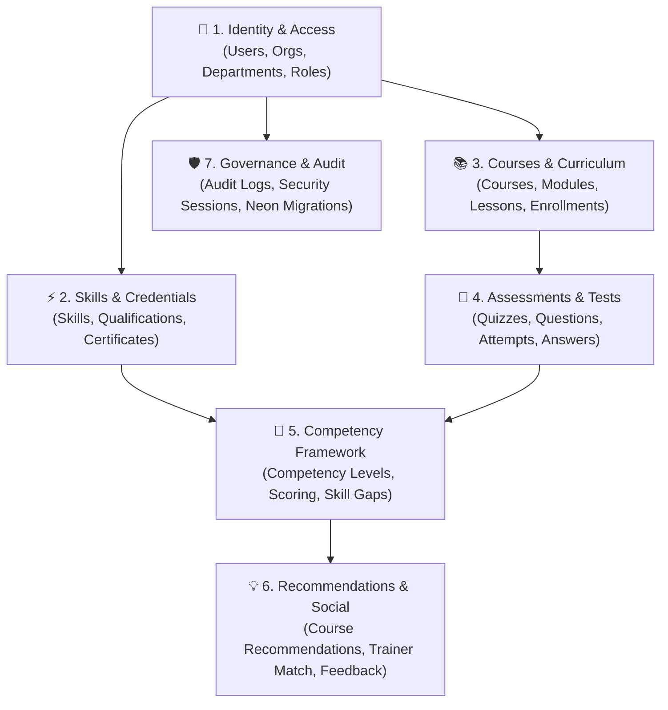

# 🗄️ Capacity Connect — Database Guide & Architecture Manual

Welcome to the **Capacity Connect** comprehensive database manual. This documentation is written in clear, accessible language to help developers, architects, and product managers understand how the database is structured, how tables connect to each other, and how data moves across the system.

---

## 🌟 High-Level Database Overview

Capacity Connect is an enterprise platform for **training, skill-gap analysis, competency tracking, and smart recommendations**.

The database is built on **Neon PostgreSQL** and managed through **Prisma ORM**. It consists of **32 interconnected tables** grouped into 7 clear functional modules:



---

## 📑 Step-by-Step Module Documentation

Click on any module below for a complete breakdown of tables, field descriptions, visual relationship diagrams, and real-world workflows:

| Step / Module | Documentation Guide | Key Tables & Functionality |
| :--- | :--- | :--- |
| **Step 1** | 👤 **[01. Identity, Organization & RBAC](./01_identity_and_access.md)** | `organizations`, `departments`, `users`, `trainee_profiles`, `trainer_profiles`, `roles`, `permissions` |
| **Step 2** | ⚡ **[02. Skills, Qualifications & Certificates](./02_skills_and_qualifications.md)** | `skills`, `user_skills`, `trainer_expertise`, `qualifications`, `work_experiences`, `certificates` |
| **Step 3** | 📚 **[03. Courses, Curriculum & Learning Resources](./03_courses_and_resources.md)** | `courses`, `course_modules`, `lessons`, `course_prerequisites`, `enrollments`, `lesson_progress`, `resources` |
| **Step 4** | 📝 **[04. Assessments, Tests & Attempts](./04_assessments_and_evaluations.md)** | `assessments`, `assessment_questions`, `question_options`, `assessment_attempts`, `assessment_answers` |
| **Step 5** | 🎯 **[05. Competencies & Skill-Gap Analysis](./05_competencies_and_skill_gaps.md)** | `competencies`, `competency_levels`, `course_competencies`, `user_competencies`, `skill_gaps` |
| **Step 6** | 💡 **[06. Recommendations, Matching & Audit](./06_recommendations_and_engagement.md)** | `recommendations`, `trainer_matches`, `feedbacks`, `announcements`, `notifications`, `audit_logs` |
| **Step 7** | 🚀 **[07. Migrations, Neon Setup & Verification](./07_migrations_and_verification.md)** | Neon setup guide, PgBouncer pooler vs Direct URL, migration history, and verification scripts |

---

## 🔄 The Complete End-to-End Trainee Journey

Here is how all tables work together in a real-world scenario:

1. **User Registration & Profile**: A learner joins an `Organization`, gets assigned to a `Department`, and a `TraineeProfile` is created.
2. **Skill Baseline**: The learner selects existing skills (`UserSkill`), e.g., *Python (Level 2)*.
3. **Skill-Gap Diagnosis**: The system compares their current level against their role target (*Level 4*) and creates a `SkillGap` record.
4. **Smart Course Recommendation**: The rule engine identifies the gap and generates a `Recommendation` for *Advanced Python*.
5. **Enrollment & Study**: The learner starts the course (`Enrollment`) and tracks completed lessons (`LessonProgress`).
6. **Certification Assessment**: The learner takes the final test (`AssessmentAttempt` & `AssessmentAnswer`).
7. **Competency Attainment**: Passing the test creates an `AssessmentCompetencyResult` and automatically upgrades the learner's `UserCompetency` to Level 4, marking the `SkillGap` as resolved!

---

## 🛠️ Quick Database Commands

```bash
# Format and validate schema
npx prisma format
npx prisma validate

# Generate TypeScript client
npx prisma generate

# Apply migrations to Neon database
npx prisma migrate dev --name init_capacity_connect

# Run database seed with demo accounts
npx prisma db seed

# Run the 13-point relational test suite
npx ts-node prisma/verify_db.ts
```
