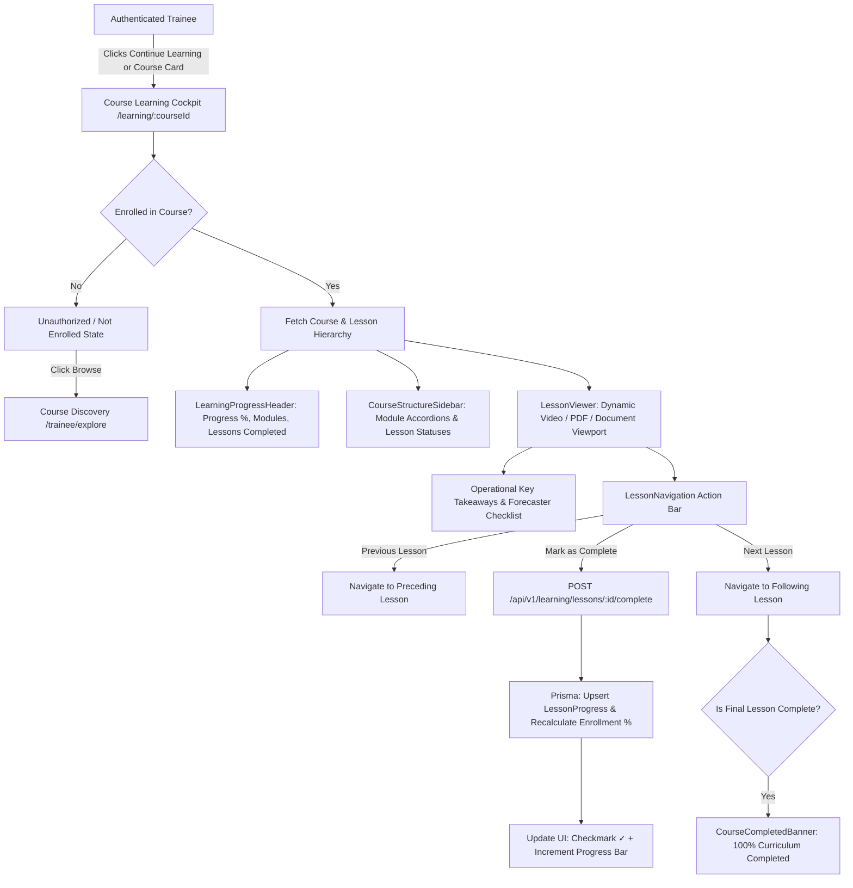

# Development 5 — Learning Experience

> **Capacity Connect** — Ministry of Earth Sciences (MoES) / India Meteorological Department (IMD) Enterprise Learning & Capacity Building Platform

---

## 1. Overview
The **Learning Experience** module powers the core educational delivery interface for authenticated trainees (meteorological observers, forecasters, radar engineers, and earth science officers) enrolled in accredited capacity-building courses. It provides a structured, responsive learning cockpit that sequences modules, presents interactive video lectures and operational technical manuals (PDFs/documents), tracks granular lesson-level progress, and dynamically drives the trajectory towards course completion.

---

## 2. Objective
- **Sequential Curricular Delivery**: Present course modules and lessons in strict pedagogical order aligned with WMO-258 standards.
- **Multi-Format Content Viewing**: Deliver HTML5 video lectures with custom accessible controls (speed, scrubber, fullscreen) and technical PDFs/manuals with responsive page and zoom controls.
- **Persistent Progress Tracking**: Accurately calculate and persist progress percentages at both the module and overall course level.
- **One-Click Lesson Completion**: Seamlessly mark lessons complete, update the database, and auto-navigate to the next lesson.
- **Continue Learning Resume Point**: Enable one-click resumption from the Trainee Dashboard directly to the trainee's last unfinished lesson.
- **Trilingual Government Support**: Full dynamic localization across English (`en`), Hindi (`hi`), and Tamil (`ta`).

---

## 3. User Role & Access Control
- **Primary Role**: `TRAINEE`
- **Audit & Supervision Roles**: `ADMIN`, `SUPER_ADMIN`
- **Access Guard**:
  - Trainees can access learning resources **only for courses in which they are officially enrolled**.
  - Unenrolled access attempts are blocked with a clear `UnauthorizedState` displaying an informational notice and a direct link to Course Discovery (`/trainee/explore`).
  - Backend authorization validates user ownership: trainee ID is derived strictly from the verified JWT session (`req.user.userId`).

---

## 4. Architecture & Functional Flow



---

## 5. Course Structure & Layout
The desktop layout provides a 2-column workspace:
- **Left Column (4/12)**: `CourseStructureSidebar` featuring:
  - Header with total module count and curriculum metadata.
  - Collapsible module accordions (`ModuleAccordion`) showing module progress percentages.
  - Interactive lesson list items (`LessonListItem`) with visual state icons:
    - `✓` (Green): Completed lesson.
    - `▶` (Blue fill): Active / currently playing lesson.
    - `○` (Slate): Not started.
- **Right Column (8/12)**: `LessonViewer` featuring:
  - Module breadcrumb, lesson title, duration, and status badges.
  - Dynamic media viewport (HTML5 video player or PDF reader).
  - Operational Key Takeaways and Forecaster Operational Checklist.
  - Audio/Video transcript (collapsible).
- **Sticky Bottom Bar**: `LessonNavigation` hosting `[ ← Previous Lesson ]`, `[ Mark as Complete / ✓ Completed ]`, and `[ Next Lesson → ]`.
- **Mobile Viewport**: The sidebar transforms into an expandable drawer with touch-friendly controls and zero horizontal overflow.

---

## 6. Video Content Engine
Implemented in `VideoPlayer.tsx`:
- Native HTML5 `<video>` tag with custom overlay controls.
- Play/Pause toggle with large centered interactive touch overlay.
- Timeline scrubber with elapsed time and total duration display (`mm:ss`).
- Volume slider with mute/unmute toggle.
- Playback rate menu supporting `0.75x`, `1.0x`, `1.25x`, `1.5x`, and `2.0x`.
- Fullscreen expand/collapse via HTML5 Fullscreen API.
- Auto-complete hook when video playback finishes.

---

## 7. PDF & Technical Document Engine
Implemented in `PdfViewer.tsx`:
- Responsive document viewport with dark slate backdrop.
- Zoom controls: Zoom In (`+15%`), Zoom Out (`-15%`), Reset Zoom (`100%`).
- Page navigation: `Previous Page`, `Next Page`, `Page X of Y`.
- External link action: `Open Document in New Tab` / `Download PDF`.
- Clean typography rendering for technical meteorological manuals, formulas, and sensor calibration charts.

---

## 8. Progress Tracking & Persistence
- **Lesson Level**: Recorded in `LessonProgress` table with boolean `completed` and timestamp `completedAt`.
- **Module Level**: Dynamically computed as `(completedLessonsInModule / totalLessonsInModule) * 100`.
- **Course Level**: Computed as `(totalCompletedLessonsInCourse / totalLessonsInCourse) * 100`. Stored in `Enrollment.progressPercentage`.
- **Status Lifecycle**:
  - `ENROLLED`: 0% completed.
  - `IN_PROGRESS`: > 0% and < 100%.
  - `COMPLETED`: 100% completed.
- **Offline Resilience**: When backend database services are in standalone development mode, progress is maintained through an interactive local state machine that persists across navigation and tab switches.

---

## 9. Next Lesson & Previous Lesson Logic
Curriculum ordering is determined across all modules sequentially:
1. Module 1: Lessons 1, 2, 3...
2. Module 2: Lessons 1, 2...
- `Previous Lesson`: Disabled when viewing the first lesson of the first module.
- `Next Lesson`: Disabled when viewing the last lesson of the final module.
- `Course Completion`: Triggered when the final lesson is marked complete, displaying the `CourseCompletedBanner`.

---

## 10. Continue Learning Integration
Supports direct entry points:
- `/learning/[courseId]`: Automatically resolves and loads the trainee's first uncompleted lesson.
- `/trainee/courses/[courseId]`: Routes "Continue Learning" and "Resume Learning" buttons from the Trainee Dashboard and My Courses page directly into the learning cockpit.

---

## 11. Backend Architecture

Follows the project's strict separation of concerns:
```
Route (backend/src/routes/learning-experience.routes.ts)
  ↓
Middlewares (authenticate, requireRole([TRAINEE, ADMIN, SUPER_ADMIN]), validate)
  ↓
Controller (backend/src/controllers/learning-experience.controller.ts)
  ↓
Service (backend/src/services/learning-experience.service.ts)
  ↓
Repository (backend/src/repositories/learning-experience.repository.ts)
  ↓
Prisma Client (backend/src/database/prisma.client.ts)
  ↓
PostgreSQL Database
```

---

## 12. Database Models Utilized
Reused existing Prisma schema entities without requiring any schema migrations:
- `Course`: Program metadata, title, duration, category.
- `CourseModule`: Sequential modular groupings (`orderIndex`).
- `Lesson`: Lesson titles, descriptions, content types (`VIDEO`, `PDF`, `DOCUMENT`), durations, order.
- `Enrollment`: Trainee-course binding, overall progress percentage, completion status.
- `LessonProgress`: Trainee-lesson completion flag, timestamps.
- `User`: Trainee and instructor identity records.

---

## 13. API Specifications

### 1. Course Learning Overview
- **Method / Path**: `GET /api/v1/learning/courses/:courseId`
- **Purpose**: Fetch full curriculum tree with modules, lessons, and trainee completion status.
- **Authentication**: Required (`Bearer JWT`).
- **Authorization**: `TRAINEE`, `ADMIN`, `SUPER_ADMIN`. Enforces enrollment check for trainee.
- **Request Params**: `courseId` (UUID string).
- **Response**:
  ```json
  {
    "success": true,
    "message": "Course learning overview retrieved successfully",
    "data": {
      "id": "course-1",
      "title": "Satellite Meteorology & INSAT-3DR Multispectral Imagery",
      "totalModules": 3,
      "totalLessons": 7,
      "completedLessons": 3,
      "currentLessonId": "les-1-3",
      "enrollment": {
        "status": "IN_PROGRESS",
        "progressPercentage": 42
      },
      "modules": [...]
    }
  }
  ```
- **Errors**: `401 Unauthorized`, `403 Forbidden` (Not enrolled), `404 Not Found`.

### 2. Lesson Details & Resource
- **Method / Path**: `GET /api/v1/learning/lessons/:lessonId`
- **Purpose**: Retrieve lesson resources, video URL, PDF content, and surrounding lesson IDs.
- **Authentication**: Required (`Bearer JWT`).
- **Authorization**: `TRAINEE`, `ADMIN`, `SUPER_ADMIN`.
- **Request Params**: `lessonId` (UUID string).
- **Response**:
  ```json
  {
    "success": true,
    "message": "Lesson details retrieved successfully",
    "data": {
      "id": "les-1-3",
      "moduleId": "mod-1",
      "moduleTitle": "Module 1: Principles...",
      "courseId": "course-1",
      "title": "Lesson 1.3: Radiative Transfer...",
      "contentType": "VIDEO",
      "resourceUrl": "https://.../video.mp4",
      "completed": false,
      "previousLessonId": "les-1-2",
      "nextLessonId": "les-2-1"
    }
  }
  ```

### 3. Mark Lesson Complete
- **Method / Path**: `POST /api/v1/learning/lessons/:lessonId/complete`
- **Purpose**: Persist lesson completion, recalculate course percentage, and return next lesson.
- **Authentication**: Required (`Bearer JWT`).
- **Authorization**: `TRAINEE` (Self-ownership enforced).
- **Request Params**: `lessonId` (UUID string).
- **Response**:
  ```json
  {
    "success": true,
    "message": "Lesson marked as complete",
    "data": {
      "lessonId": "les-1-3",
      "completed": true,
      "courseProgressPercentage": 57,
      "courseStatus": "IN_PROGRESS",
      "nextLessonId": "les-2-1"
    }
  }
  ```

### 4. Course Progress Summary
- **Method / Path**: `GET /api/v1/learning/courses/:courseId/progress`
- **Purpose**: Fast polling/query endpoint for course completion metrics.
- **Authentication**: Required (`Bearer JWT`).
- **Authorization**: `TRAINEE`, `ADMIN`, `SUPER_ADMIN`.

---

## 14. Multilingualism (English / हिन्दी / தமிழ்)
Driven by `frontend/src/features/learning-experience/utils/i18n.ts` and synced with `useLanguageStore`:
- All control labels (*Play*, *Pause*, *Speed*, *Fullscreen*, *Zoom In*, *Next Lesson*, *Previous Lesson*, *Mark as Complete*).
- All status tags (*Completed*, *In Progress*, *Not Started*, *Preview Available*).
- All progress metrics (*Overall Completion*, *Lessons Completed*, *Modules*).
- All notifications (*Lesson Completed*, *Course Curriculum Completed*, *Access Denied*).

---

## 15. Files Created & Modified

| Component | File Path | Description |
| :--- | :--- | :--- |
| **Backend DTOs** | `backend/src/dto/learning-experience.dto.ts` | Data transfer interfaces for learning view |
| **Backend Validator** | `backend/src/validators/learning-experience.validator.ts` | Zod validation schemas |
| **Backend Repository** | `backend/src/repositories/learning-experience.repository.ts` | Prisma database queries |
| **Backend Service** | `backend/src/services/learning-experience.service.ts` | Business logic & progress recalculations |
| **Backend Controller**| `backend/src/controllers/learning-experience.controller.ts` | HTTP controller |
| **Backend Routes** | `backend/src/routes/learning-experience.routes.ts` | Express router with auth & validation |
| **Backend Index** | `backend/src/routes/index.ts` | Mounted under `/api/v1/learning` |
| **Frontend Types** | `frontend/src/features/learning-experience/types/learning-experience.types.ts` | TypeScript domain types |
| **Frontend API** | `frontend/src/features/learning-experience/api/learningApi.ts` | API client methods |
| **Frontend Hook** | `frontend/src/features/learning-experience/hooks/useLearningCourse.ts` | TanStack Query hook with state sync |
| **Frontend i18n** | `frontend/src/features/learning-experience/utils/i18n.ts` | English, Hindi, and Tamil dictionary |
| **Frontend Mock** | `frontend/src/features/learning-experience/utils/mockLearningData.ts` | Domain-accurate MoES/IMD courses & lessons |
| **Frontend UI** | `frontend/src/features/learning-experience/components/CourseLearningPage.tsx` | Master learning cockpit component |
| | `frontend/src/features/learning-experience/components/CourseStructureSidebar.tsx` | Sidebar with module tree |
| | `frontend/src/features/learning-experience/components/ModuleAccordion.tsx` | Collapsible module component |
| | `frontend/src/features/learning-experience/components/LessonListItem.tsx` | Individual lesson list item |
| | `frontend/src/features/learning-experience/components/LessonViewer.tsx` | Resource viewer viewport |
| | `frontend/src/features/learning-experience/components/VideoPlayer.tsx` | HTML5 video player with custom controls |
| | `frontend/src/features/learning-experience/components/PdfViewer.tsx` | PDF & document reader with zoom & pages |
| | `frontend/src/features/learning-experience/components/LearningProgressHeader.tsx` | Progress bar & course metadata |
| | `frontend/src/features/learning-experience/components/LessonNavigation.tsx` | Sticky bottom navigation bar |
| | `frontend/src/features/learning-experience/components/CourseCompletedBanner.tsx` | 100% completion celebration banner |
| | `frontend/src/features/learning-experience/components/UnauthorizedState.tsx` | Blocked state for unenrolled courses |
| **Barrel Export** | `frontend/src/features/learning-experience/index.ts` | Clean feature public export |
| **Next.js Routes** | `frontend/src/app/learning/layout.tsx` | Layout wrapping learning pages in AppShell |
| | `frontend/src/app/learning/[courseId]/page.tsx` | Course overview & resume route |
| | `frontend/src/app/learning/[courseId]/lesson/[lessonId]/page.tsx` | Direct lesson viewing route |
| | `frontend/src/app/trainee/courses/[courseId]/page.tsx` | Continue Learning destination route |
| **Documentation** | `docs/learning-experience/README.md` | Comprehensive 25-section module specification |

---

## 16. Git Information
- **Branch**: `feature/learning-experience`
- **Commits**:
  - `feat: implement learning experience module with course structure, video/pdf viewers, progress tracking, and navigation`
  - `docs: document learning experience architecture and API contracts`
