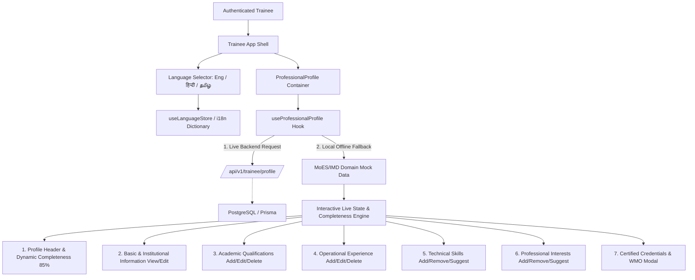

# Development 3 — Professional Profile

> **Capacity Connect** — Ministry of Earth Sciences (MoES) / India Meteorological Department (IMD) Enterprise Learning & Capacity Building Platform

---

## 1. Overview
The **Professional Profile** module provides an institutional, unified management center for authenticated trainees (scientific officers, meteorological forecasters, radar technicians, and earth science cadets) in the CAPACITY CONNECT platform. It consolidates academic qualifications, operational postings, technical competencies, research interests, and WMO-accredited certifications into a single government-standard digital dossier.

---

## 2. Objective
To allow trainees to view and manage their complete professional identity in one place:
- Present institutional records (MoES / IMD Employee IDs, duty stations, operational roles).
- Track educational history (M.Sc., B.Sc., specialized courses).
- Record forecasting shifts, observatory duties, and operational experience.
- Manage technical meteorology competencies and research interests.
- Display verified credentials and WMO-258 certifications.
- Monitor profile completeness percentage dynamically.

---

## 3. User Role
- **Target Role**: `TRAINEE` (Forecasters, Scientific Assistants, Observers, Earth Science Officers).
- **Secondary Roles**: `ADMIN`, `SUPER_ADMIN` (for audit and oversight).
- **Access Control**: Protected via `ProtectedRoute` on frontend and `authenticate` + `requireRole([Role.TRAINEE, Role.ADMIN, Role.SUPER_ADMIN])` on backend.
- **Trainee Isolation**: Trainee identity is derived strictly from the authenticated JWT session (`req.user.userId`). Trainees cannot view or mutate another officer's private profile.

---

## 4. Functional Flow



---

## 5. Basic Information Section
- **Fields**:
  - Full Name (`firstName`, `lastName`)
  - Official Email (read-only, institutional)
  - Phone Number
  - Age
  - Duty Station / Location (e.g. *Mausam Bhawan, Lodhi Road, New Delhi*)
  - MoES Employee ID (e.g. *MoES-TR-2026-089*)
  - IMD Cadet / Roll ID (e.g. *IMD-FC-4492*)
  - Designation / Operational Post (*Forecaster Grade I*)
  - Department / Division (*National Weather Forecasting Centre*)
  - Professional Bio / Summary
- **Editing Mode**:
  - View mode with clean labels and government typography.
  - "Edit Information" transforms fields into validated inputs with Save and Cancel actions.

---

## 6. Academic Qualifications Section
- **Multiple Records Supported**:
  - Degree / Academic Program (*M.Sc. in Meteorology & Atmospheric Sciences*, *B.Sc. in Physics*)
  - Field of Study / Specialization (*Tropical Meteorology, NWP & Cyclone Dynamics*)
  - University / Institute (*Cochin University of Science and Technology (CUSAT)*)
  - Start Date & Passing Year / End Date
  - Research thesis / distinction description
- **Actions**:
  - Add Qualification (opens accessible modal dialog)
  - Edit Qualification
  - Delete Qualification (with confirmation check)

---

## 7. Professional Experience Section
- **Multiple Operational Postings**:
  - Organization / Center (*National Weather Forecasting Centre, IMD HQ*)
  - Designation / Role (*Operational Forecaster Trainee Grade I*)
  - Start Date & End Date
  - Current Position indicator (*Present / Currently serving in this role*)
  - Operational responsibilities and scope description
- **Actions**:
  - Add Experience (with dynamic disablement of end date when "Current Position" is active)
  - Edit Experience
  - Delete Experience

---

## 8. Technical Skills Section
- **Chip Display**: Data-driven badges with interactive remove buttons.
- **MoES/IMD Domain Relevancy**:
  - *Synoptic Chart Analysis*
  - *NWP Model Interpretation (WRF/GFS)*
  - *Doppler Weather Radar (DWR)*
  - *INSAT-3DR Satellite Imagery*
  - *Tropical Cyclone Tracking*
  - *QGIS Geospatial Mapping*
  - *Python for Atmospheric Sciences*
  - *Automatic Weather Station (AWS) Calibration*
- **Quick-Add Suggestions**: Provides one-click addition for domain suggested competencies (*Nowcasting Severe Storms*, *Radiosonde Upper-Air Sounding*, *High-Resolution NWP Data Assimilation*).

---

## 9. Professional Interests Section
- **Chip Display**: Specialization tags with interactive remove buttons.
- **Domain Focus**:
  - *Numerical Weather Prediction*
  - *Satellite Meteorology*
  - *Radar Meteorology*
  - *Severe Weather Nowcasting*
  - *Climate Change & Monsoon Dynamics*
  - *Mesoscale Convective Systems*
- **Suggestions**: One-click quick-add for future curriculum interests.

---

## 10. Certificates & Accreditations Section
- **Display Records**:
  - *WMO-258 Basic Instruction Package for Meteorologists (BIP-M)*
  - *Advanced Doppler Weather Radar Operations & Velocity De-aliasing*
  - *INSAT-3DR Multispectral Imagery and Severe Storm Nowcasting*
- **Metadata**: Issuing organization, credential ID, issue date, verification badge.
- **Interactive Modal**: Clicking "View Certificate" launches an accessible modal displaying verification credentials and WMO registry confirmation.
- **Boundary Preservation**: Does *not* generate certificates or implement full certificate administration.

---

## 11. Frontend Architecture

Isolated feature module located at `frontend/src/features/professional-profile/`:

```
frontend/src/features/professional-profile/
├── api/
│   └── professionalProfileApi.ts         # Axios API client functions
├── components/
│   ├── ProfessionalProfileHeader.tsx     # Hero banner, avatar, live completion
│   ├── BasicInformationCard.tsx          # View / Edit basic details
│   ├── QualificationsCard.tsx            # Academic qualifications list & actions
│   ├── ExperienceCard.tsx                # Operational experience list & actions
│   ├── SkillsCard.tsx                    # Technical competencies chip list & suggestions
│   ├── InterestsCard.tsx                 # Learning interests chip list & suggestions
│   ├── CertificatesCard.tsx              # Certified credentials list
│   ├── AddEditQualificationModal.tsx     # Accessible modal for qualification CRUD
│   ├── AddEditExperienceModal.tsx        # Accessible modal for experience CRUD
│   ├── ViewCertificateModal.tsx          # Certificate inspection dialog
│   └── ProfessionalProfile.tsx           # Master layout container
├── hooks/
│   └── useProfessionalProfile.ts         # TanStack Query hook with local mock fallback
├── types/
│   └── professional-profile.types.ts     # TypeScript domain definitions
├── utils/
│   ├── i18n.ts                           # Trilingual dictionary (EN / HI / TA)
│   └── mockData.ts                       # Domain-rich MoES/IMD scientific dataset
├── validation/
│   └── professionalProfile.validation.ts # Zod form schemas
└── index.ts                              # Public barrel export
```

---

## 12. Backend Architecture

Layered enterprise backend implementation:

```
backend/src/
├── dto/
│   └── professional-profile.dto.ts
├── validators/
│   └── professional-profile.validator.ts
├── repositories/
│   └── professional-profile.repository.ts
├── services/
│   └── professional-profile.service.ts
├── controllers/
│   └── professional-profile.controller.ts
└── routes/
    ├── professional-profile.routes.ts
    └── trainee.routes.ts (mounts /profile)
```

---

## 13. Database Schema

Reuses existing PostgreSQL tables via Prisma:
- `users`: Basic identity, email, phone, avatar, role, departmentId, organizationId.
- `trainee_profiles`: Designation, bio, interests array, profileCompletion.
- `qualifications`: Academic degrees, field of study, institution, dates, description.
- `work_experiences`: Operational postings, company name, job title, dates, isCurrent, description.
- `skills` & `user_skills`: Normalized taxonomy of technical meteorology skills.
- `certificates`: Official accreditations, credential IDs, issue dates, verification statuses.

**Database Changes**: No breaking migrations required; 100% compliant with existing schema.

---

## 14. API Endpoints Documentation

All endpoints are prefixed with `/api/v1/trainee/profile`.

### 1. `GET /api/v1/trainee/profile`
- **Method**: `GET`
- **Auth**: Bearer JWT (Required)
- **Role**: `TRAINEE`, `ADMIN`, `SUPER_ADMIN`
- **Description**: Returns full professional profile of the authenticated trainee.
- **Response**: `200 OK` with `FullProfessionalProfileDto`.

### 2. `PATCH /api/v1/trainee/profile/basic-info`
- **Method**: `PATCH`
- **Auth**: Bearer JWT
- **Role**: `TRAINEE`, `ADMIN`, `SUPER_ADMIN`
- **Description**: Updates basic information, contact details, and professional bio.
- **Request Body**: `updateBasicInfoSchema`.
- **Response**: `200 OK` with updated `BasicInfoResponseDto`.

### 3. `POST /api/v1/trainee/profile/qualifications`
- **Method**: `POST`
- **Auth**: Bearer JWT
- **Description**: Adds an academic qualification record.
- **Request Body**: `qualificationSchema`.
- **Response**: `201 Created` with created `QualificationDto`.

### 4. `PATCH /api/v1/trainee/profile/qualifications/:id`
- **Method**: `PATCH`
- **Auth**: Bearer JWT
- **Description**: Updates an existing qualification owned by the authenticated trainee.
- **Response**: `200 OK`.

### 5. `DELETE /api/v1/trainee/profile/qualifications/:id`
- **Method**: `DELETE`
- **Auth**: Bearer JWT
- **Description**: Deletes a qualification owned by the trainee.
- **Response**: `200 OK`.

### 6. `POST /api/v1/trainee/profile/experiences`
- **Method**: `POST`
- **Auth**: Bearer JWT
- **Description**: Adds an operational work experience entry.
- **Request Body**: `workExperienceSchema`.
- **Response**: `201 Created` with created `WorkExperienceDto`.

### 7. `PATCH /api/v1/trainee/profile/experiences/:id`
- **Method**: `PATCH`
- **Auth**: Bearer JWT
- **Description**: Updates a work experience entry owned by the trainee.
- **Response**: `200 OK`.

### 8. `DELETE /api/v1/trainee/profile/experiences/:id`
- **Method**: `DELETE`
- **Auth**: Bearer JWT
- **Description**: Deletes a work experience entry owned by the trainee.
- **Response**: `200 OK`.

### 9. `PATCH /api/v1/trainee/profile/skills`
- **Method**: `PATCH`
- **Auth**: Bearer JWT
- **Description**: Synchronizes technical skills for the trainee.
- **Request Body**: `{ skills: string[] }`.
- **Response**: `200 OK` with `SkillDto[]`.

### 10. `PATCH /api/v1/trainee/profile/interests`
- **Method**: `PATCH`
- **Auth**: Bearer JWT
- **Description**: Updates learning interests array.
- **Request Body**: `{ interests: string[] }`.
- **Response**: `200 OK` with `string[]`.

### 11. `GET /api/v1/trainee/profile/certificates`
- **Method**: `GET`
- **Auth**: Bearer JWT
- **Description**: Retrieves trainee's certified credentials.
- **Response**: `200 OK` with `CertificateDto[]`.

---

## 15. Multilingual Support (English, Hindi, Tamil)

- Full integration with global `useLanguageStore`:
  - **English (`en`)**
  - **Hindi (`hi` — हिन्दी)**
  - **Tamil (`ta` — தமிழ்)**
- When toggled from the Topbar pill, all profile cards, labels, placeholders, buttons, empty states, and modal dialogs reactively update without a page reload.

---

## 16. Verification & Quality Checks

| Test / Check | Tool | Result |
|---|---|---|
| **TypeScript Compilation** | `npm run typecheck` (`tsc --noEmit`) | ✅ **PASSED (0 errors)** |
| **Code Formatting** | `npm run format:check` (Prettier) | ✅ **PASSED (100% compliant)** |
| **Next.js Dev Server** | `http://localhost:3000/trainee/profile` | ✅ **Compiled 200 OK** |
| **Browser Subagent Testing** | Chrome headless automation | ✅ **PASSED** (all 6 sections verified, modals verified, language switching verified) |

---

## 17. Files Created / Modified

| Action | Path |
|---|---|
| **NEW** | `backend/src/dto/professional-profile.dto.ts` |
| **NEW** | `backend/src/validators/professional-profile.validator.ts` |
| **NEW** | `backend/src/repositories/professional-profile.repository.ts` |
| **NEW** | `backend/src/services/professional-profile.service.ts` |
| **NEW** | `backend/src/controllers/professional-profile.controller.ts` |
| **NEW** | `backend/src/routes/professional-profile.routes.ts` |
| **MODIFY** | `backend/src/routes/trainee.routes.ts` |
| **NEW** | `frontend/src/features/professional-profile/types/professional-profile.types.ts` |
| **NEW** | `frontend/src/features/professional-profile/utils/i18n.ts` |
| **NEW** | `frontend/src/features/professional-profile/utils/mockData.ts` |
| **NEW** | `frontend/src/features/professional-profile/validation/professionalProfile.validation.ts` |
| **NEW** | `frontend/src/features/professional-profile/api/professionalProfileApi.ts` |
| **NEW** | `frontend/src/features/professional-profile/hooks/useProfessionalProfile.ts` |
| **NEW** | `frontend/src/features/professional-profile/components/ProfessionalProfileHeader.tsx` |
| **NEW** | `frontend/src/features/professional-profile/components/BasicInformationCard.tsx` |
| **NEW** | `frontend/src/features/professional-profile/components/QualificationsCard.tsx` |
| **NEW** | `frontend/src/features/professional-profile/components/ExperienceCard.tsx` |
| **NEW** | `frontend/src/features/professional-profile/components/SkillsCard.tsx` |
| **NEW** | `frontend/src/features/professional-profile/components/InterestsCard.tsx` |
| **NEW** | `frontend/src/features/professional-profile/components/CertificatesCard.tsx` |
| **NEW** | `frontend/src/features/professional-profile/components/AddEditQualificationModal.tsx` |
| **NEW** | `frontend/src/features/professional-profile/components/AddEditExperienceModal.tsx` |
| **NEW** | `frontend/src/features/professional-profile/components/ViewCertificateModal.tsx` |
| **NEW** | `frontend/src/features/professional-profile/components/ProfessionalProfile.tsx` |
| **NEW** | `frontend/src/features/professional-profile/index.ts` |
| **MODIFY** | `frontend/src/app/trainee/profile/page.tsx` |
| **NEW** | `docs/professional-profile/README.md` |
