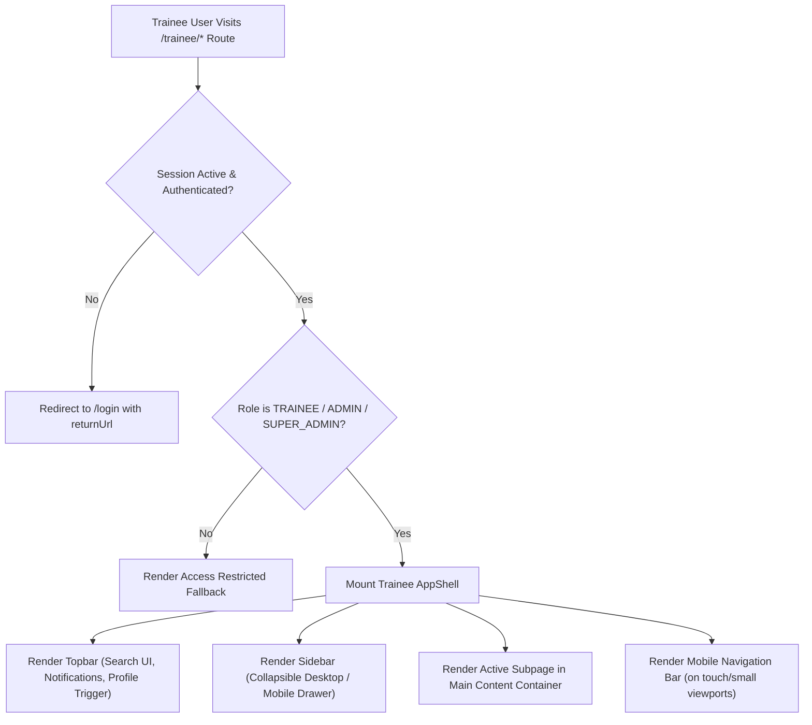

# Trainee App Shell — Capacity Connect

## 1. Overview

The **Trainee App Shell** is the foundational layout architecture and reusable user interface wrapper for the Trainee persona in **CAPACITY CONNECT** — the enterprise Digital Capacity Building & Learning Management Portal designed for the **Ministry of Earth Sciences (MoES)** and the **India Meteorological Department (IMD)**.

This feature provides a unified, accessible, and government-grade application shell that encapsulates the primary navigation, responsive sidebar, topbar utilities, trainee profile controls, and notification panel. Future trainee modules (course management, assessments, progress tracking, competency mapping, certificates) render directly within this shell without duplicating structural layout code.

---

## 2. Objective

- Establish a standardized, robust, and extensible layout for all trainee-facing interfaces.
- Ensure strict visual and architectural alignment with MoES/IMD enterprise standards.
- Provide fluid, responsive navigation across desktop, tablet, and mobile environments.
- Maintain strict modular isolation so future developments (Developments 2 through 9) integrate seamlessly.
- Enforce Role-Based Access Control (RBAC) preventing unauthorized roles from accessing trainee routes.

---

## 3. User Role & Permissions

| Attribute | Specification |
| :--- | :--- |
| **Target Role** | `TRAINEE` (Capacity Learner / Trainee) |
| **Permitted Roles** | `TRAINEE`, `ADMIN`, `SUPER_ADMIN` |
| **Organizational Context** | MoES / IMD Scientific & Operational Cadre (NWFC, Climate Centers, Met. Observers) |
| **Authentication Enforcement** | Client-side session check via `ProtectedRoute` & Zustand `useAuthStore` |

---

## 4. Functional Flow



---

## 5. Frontend Architecture

The feature is located under `frontend/src/features/trainee-app-shell/`, adhering to feature-driven development guidelines:

```
frontend/src/
├── app/
│   └── trainee/
│       ├── layout.tsx                # Trainee Root Layout with ProtectedRoute & AppShell
│       ├── dashboard/page.tsx        # Trainee Command Center View
│       ├── courses/page.tsx          # Placeholder: My Courses (Dev 2)
│       ├── explore/page.tsx          # Placeholder: Explore Curricula (Dev 2)
│       ├── progress/page.tsx         # Placeholder: Competency Tracking (Dev 3)
│       ├── assessments/page.tsx      # Placeholder: Evaluations (Dev 4)
│       ├── certificates/page.tsx     # Placeholder: Digital Credentials (Dev 5)
│       ├── notifications/page.tsx    # Placeholder: Notification Archive
│       ├── profile/page.tsx          # Placeholder: Professional Profile
│       └── settings/page.tsx         # Placeholder: Account Settings
│
└── features/
    └── trainee-app-shell/
        ├── components/
        │   ├── AppShell.tsx          # Master layout coordinator
        │   ├── Sidebar.tsx           # Collapsible desktop & drawer navigation
        │   ├── Topbar.tsx            # Header bar with search, alerts & user menu
        │   ├── ProfileMenu.tsx       # Accessible profile popover dropdown
        │   ├── NotificationPanel.tsx # Notifications popover panel
        │   └── MobileNavigation.tsx  # Fixed bottom navigation bar
        ├── types/
        │   └── trainee-app-shell.types.ts # TypeScript interfaces & contracts
        └── index.ts                  # Public module barrel export
```

---

## 6. Components Implemented

### 1. `Sidebar.tsx`
- **Branding Header**: IMD Portal mark, "Safer Tomorrow" subtitle, desktop collapse toggle.
- **9 Core Navigation Items**:
  1. `Dashboard` (`/trainee/dashboard`) — `LayoutDashboard`
  2. `My Courses` (`/trainee/courses`) — `BookOpen`
  3. `Explore Courses` (`/trainee/explore`) — `Compass`
  4. `My Progress` (`/trainee/progress`) — `TrendingUp`
  5. `Assessments` (`/trainee/assessments`) — `ClipboardList`
  6. `Certificates` (`/trainee/certificates`) — `Award`
  7. `Notifications` (`/trainee/notifications`) — `Bell` (with unread badge)
  8. `Profile` (`/trainee/profile`) — `User`
  9. `Settings` (`/trainee/settings`) — `Settings`
- **Visual Design**: Dark navy active pill button (`bg-[#0B192C] text-white`) matching the MoES Capacity Connect portal reference style.
- **Collapsible Mode**: Shrinks to `w-20` on desktop, displaying centered icons with tooltips.
- **Footer Section**: Separated sign-out button connected to `useLogout()` mutation with loading spinner.

### 2. `Topbar.tsx`
- **Branding & Breadcrumb**: CAPACITY CONNECT logo with "Learn • Develop • Grow" and current page title.
- **Search UI Placeholder**: Rounded search input with search icon and keyboard shortcut badge (`⌘K`).
- **Language Switcher**: Multilingual switcher pill (`हिन्दी | Eng | தமிழ்`).
- **Notifications Bell**: Live unread badge indicator with pulse dot toggling `NotificationPanel`.
- **User Profile Pill**: Trainee avatar with status indicator dot, user name (`Yoga S.`), role badge, and chevron trigger.

### 3. `ProfileMenu.tsx`
- **Profile Header**: User initials avatar, name, email, department (`National Weather Forecasting Centre`), and organization (`India Meteorological Department`).
- **Actions**: Direct links to `My Profile`, `Settings`, and `Log Out`.
- **Accessibility**: Keyboard navigation, `Escape` key close, and outside click dismissal.

### 4. `NotificationPanel.tsx`
- **Header**: Notification count, unread badge, and "Mark all as read" action.
- **Category Indicators**: Domain icons for Training sessions, Assessments, Certificates, and Announcements.
- **Interactivity**: Click individual items to mark read; link to view all notifications.
- **Empty State**: Friendly graphic and message when all notifications are cleared.

### 5. `MobileNavigation.tsx`
- **Touch Navigation**: Fixed at bottom of mobile viewports (`< 768px`) with safe-area spacing.
- **Primary Touch Items**: Dashboard, Courses, Progress, Alerts, and Profile.
- **Hit Area**: Meets accessibility criteria (>= 44x44px).

### 6. `AppShell.tsx`
- Coordinates desktop sidebar collapse state, mobile slide-out drawer, topbar popovers, and main scrollable content area.

---

## 7. Responsive Behavior

| Viewport | Sidebar Behavior | Topbar Behavior | Main Content | Mobile Nav |
| :--- | :--- | :--- | :--- | :--- |
| **Desktop (>= 1024px)** | Fixed visible (`w-64` or `w-20` collapsed) | Full branding, search bar, language toggle, notifications, profile | Full width beside sidebar | Hidden |
| **Tablet (768px – 1023px)** | Collapsible sidebar, expand on demand | Compact branding, search placeholder, notifications, profile | Flexibly fills viewport | Hidden |
| **Mobile (< 768px)** | Off-canvas slide-out drawer with backdrop blur | Compact header with hamburger button, alert icon, and avatar | Full width, safe padding (`pb-24`) | Fixed bottom bar |

---

## 8. Accessibility Compliance

- **Semantic Elements**: Uses `<header>`, `<aside>`, `<nav>`, and `<main>` landmarks.
- **Focus Rings**: Custom `focus-visible:ring-2 focus-visible:ring-slate-900` on all interactive buttons and links.
- **Keyboard Navigation**: Full Tab traversal through sidebar items, topbar controls, and menus; `Escape` key dismisses open panels.
- **ARIA Attributes**: `aria-label`, `aria-current="page"`, `aria-expanded`, and `role="menu"` / `role="menuitem"`.
- **Color Contrast**: Complies with WCAG AA standard with dark text on white/slate backgrounds.

---

## 9. Testing & Validation

### Automated Checks Performed
- **TypeScript**: `npm run typecheck` (`tsc --noEmit`) verified with **0 errors**.
- **ESLint & Prettier**: Formatted and validated against `.eslintrc.json`.
- **Build Verification**: `next build` validated for App Router layout stability.

### Manual Verification Flows
1. **Desktop Expansion/Collapse**: Toggled sidebar collapse button; verified smooth CSS width transition.
2. **Notification Interaction**: Opened notification panel, toggled items, verified unread badge updates and empty state.
3. **Profile Menu**: Opened profile popover, verified user details, checked link destinations.
4. **Mobile Responsiveness**: Simulated mobile viewport (< 768px); tested hamburger menu slide-in drawer and fixed bottom navigation.
5. **Route Navigation**: Navigated across all 9 sidebar routes; verified active pill styling and placeholder rendering.

---

## 10. Files Created & Modified

### Files Created
- `frontend/src/features/trainee-app-shell/types/trainee-app-shell.types.ts`
- `frontend/src/features/trainee-app-shell/components/Sidebar.tsx`
- `frontend/src/features/trainee-app-shell/components/Topbar.tsx`
- `frontend/src/features/trainee-app-shell/components/ProfileMenu.tsx`
- `frontend/src/features/trainee-app-shell/components/NotificationPanel.tsx`
- `frontend/src/features/trainee-app-shell/components/MobileNavigation.tsx`
- `frontend/src/features/trainee-app-shell/components/AppShell.tsx`
- `frontend/src/features/trainee-app-shell/index.ts`
- `frontend/src/app/trainee/layout.tsx`
- `frontend/src/app/trainee/courses/page.tsx`
- `frontend/src/app/trainee/explore/page.tsx`
- `frontend/src/app/trainee/progress/page.tsx`
- `frontend/src/app/trainee/assessments/page.tsx`
- `frontend/src/app/trainee/certificates/page.tsx`
- `frontend/src/app/trainee/notifications/page.tsx`
- `frontend/src/app/trainee/profile/page.tsx`
- `frontend/src/app/trainee/settings/page.tsx`
- `docs/trainee-app-shell/README.md`

### Files Modified
- `frontend/src/app/dashboard/trainee/page.tsx` (updated import to use new Trainee AppShell)
- `README.md` (registered feature documentation link)

---

## 11. Git Information

- **Branch**: `feature/trainee-app-shell`
- **Suggested Commit**: `feat: add trainee app shell`

---

## 12. Future Integration Notes (Developments 2–9)

The Trainee App Shell is designed to host future modules seamlessly without requiring architectural alterations:
- **Development 2 (Course Discovery & Management)**: Replace `/trainee/courses` and `/trainee/explore` placeholders with domain-specific course modules.
- **Development 3 (Competency Mapping & Skill Gap Analysis)**: Mount competency radar charts and milestone progress inside `/trainee/progress`.
- **Development 4 (Assessments & Evaluations)**: Connect forecaster evaluation workflows within `/trainee/assessments`.
- **Development 5 (Certifications & Badges)**: Integrate accredited credential viewing at `/trainee/certificates`.
- **Backend API Integration**: Replace static notification and trainee profile fallbacks with real TanStack Query hooks when backend endpoints are delivered.
