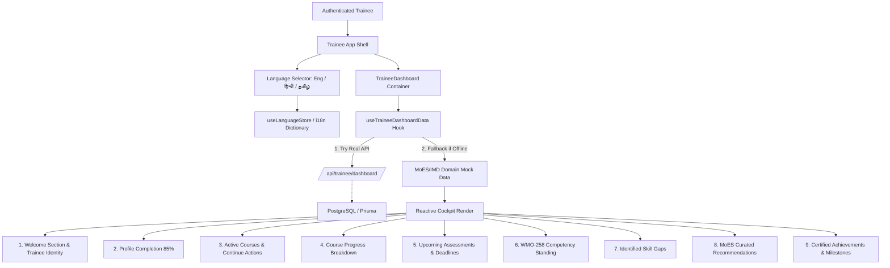

# Development 2 — Trainee Dashboard

> **Capacity Connect** — Ministry of Earth Sciences (MoES) / India Meteorological Department (IMD) Enterprise Learning & Capacity Building Platform

---

## 1. Overview
The **Trainee Dashboard** is the central learning cockpit of the CAPACITY CONNECT platform for scientific trainees, meteorologists, radar technicians, and earth science officers. It provides an immediate, actionable snapshot of their ongoing learning journey, professional skill development, upcoming assessments, competency standing against World Meteorological Organization (WMO-258) standards, and personalized curriculum recommendations.

---

## 2. Objective
To answer the core trainee questions within seconds of landing on the platform:
- *Where am I in my learning journey?*
- *What do I need to improve (competency & skill gaps)?*
- *What should I do next (active courses, upcoming assessments, and recommendations)?*

---

## 3. User Role
- **Target Role**: `TRAINEE` (Meteorological Forecasters, Scientific Assistants, Observers, Earth Science Officers).
- **Access Control**: Governed by RBAC (`ProtectedRoute` with roles `['TRAINEE', 'ADMIN', 'SUPER_ADMIN']`).
- **Data Isolation**: Each trainee's cockpit displays exclusively their personalized courses, assessments, competency evaluations, and learning history derived from their authenticated session.

---

## 4. Functional Flow



---

## 5. Dashboard Sections

The dashboard is structured into 8 modular, scannable cards adhering to government design standards (clean scientific cards, restrained shadows, accessible contrast):

### 1. Profile Completion Card
- **Indicator**: Visual circular ring and progress bar displaying 85% completion.
- **Fields Evaluated**: Name, Qualification, Location, Contact, MoES/IMD Employee ID, Primary Role.
- **CTA**: Direct action to "Complete Profile" directing to `/trainee/profile`.

### 2. Active Courses Card
- **Items**: Currently enrolled operational meteorology courses:
  - *Satellite Meteorology & Insat-3DR Image Interpretation* (Advanced, Prof. A. Sharma)
  - *Numerical Weather Prediction & Ensemble Modeling (WRF/GFS)* (Intermediate, Dr. K. Radhakrishnan)
  - *Doppler Weather Radar (DWR) Calibration & Analysis* (Operational, Smt. P. Verma)
- **Features**: Current status badge (`In Progress`, `Active`), progress bar, and "Continue Learning" trigger.

### 3. Course Progress Card
- **Metrics**: Overall learning progress (62%) with individual course breakdown progress bars.
- **Visuals**: Distinct color-coded progress bars with exact percentage metrics.

### 4. Upcoming Assessments Card
- **Items**:
  - *NWP Ensemble Data Assimilation Exam* (Due in 3 days)
  - *Satellite Cloud Pattern Identification Lab* (Due in 7 days)
  - *DWR Radial Velocity Analysis Practical* (Due in 14 days)
- **Metadata**: Course affinity, due date, duration, total marks, status (`Urgent`, `Upcoming`), and "View Assessment" action.

### 5. Competency Card
- **Score**: Overall Competency index (74%).
- **Standing**: Level 3 Operational Forecaster.
- **Standards Alignment**: WMO-258 & MoES Continuous Competency Standards.
- **Breakdown**:
  - Synoptic Chart Analysis: 88%
  - NWP Interpretation: 62%
  - Severe Storm Warning: 75%
  - Radar Velocity Interpretation: 58%

### 6. Skill Gaps Card
- **Distinction**: Clearly distinguishes between acquired proficiencies and identified development gaps.
- **Identified Gaps**:
  - *High-Resolution NWP Data Assimilation* (High Priority)
  - *Doppler Velocity De-aliasing* (Medium Priority)
  - *Nowcasting Convective Initiation* (High Priority)
- **Status Indicator**: Priority chips, domain tag, and target competency timeline.

### 7. Recommendations Card
- **Curated Offerings**: Relevant exclusively to MoES/IMD earth sciences (no generic web development or irrelevant IT courses):
  - *Advanced Nowcasting of Severe Convective Storms* (Addressed Gap: Nowcasting Convective Initiation)
  - *Mesoscale Atmospheric Modeling with WRF-ARW* (Addressed Gap: High-Resolution NWP)
- **Metadata**: Skill association, estimated hours, difficulty, and "View Course" action.

### 8. Achievements Card
- **Key Metrics**:
  - Courses Completed: 4
  - Certificates Earned: 3
  - Assessments Passed: 12
  - Learning Milestones: 6
- **Badges**: High-resolution MoES badge tokens with issue dates and verification status.

---

## 6. Frontend Architecture

The feature is isolated inside `frontend/src/features/trainee-dashboard/`:

```
frontend/src/
├── app/
│   └── trainee/
│       ├── layout.tsx                # Wraps with AppShell & ProtectedRoute
│       └── dashboard/page.tsx        # Mounts <TraineeDashboard />
├── features/
│   ├── trainee-app-shell/            # Development 1 App Shell & Topbar
│   └── trainee-dashboard/            # Development 2 Trainee Dashboard
│       ├── components/
│       │   ├── WelcomeSection.tsx
│       │   ├── ProfileCompletionCard.tsx
│       │   ├── ActiveCoursesCard.tsx
│       │   ├── CourseProgressCard.tsx
│       │   ├── UpcomingAssessmentsCard.tsx
│       │   ├── CompetencyCard.tsx
│       │   ├── SkillGapCard.tsx
│       │   ├── RecommendationCard.tsx
│       │   ├── AchievementsCard.tsx
│       │   └── TraineeDashboard.tsx  # Master container layout
│       ├── hooks/
│       │   └── useTraineeDashboardData.ts # Resilient data hook
│       ├── types/
│       │   └── trainee-dashboard.types.ts # Strict TypeScript schemas
│       ├── utils/
│       │   ├── i18n.ts               # Trilingual dictionary (EN / HI / TA)
│       │   └── mockData.ts           # Domain-rich MoES/IMD fallback data
│       └── index.ts                  # Public barrel export
└── store/
    └── language.ts                   # Reactive Zustand language store
```

---

## 7. Multilingual Support (English, Hindi, Tamil)

### Architecture
- **State Store**: Persistent Zustand store in `frontend/src/store/language.ts` with local storage persistence key `moes-imd-language`.
- **Supported Locales**:
  - `en`: English
  - `hi`: हिन्दी (Hindi)
  - `ta`: தமிழ் (Tamil)
- **Switcher Location**: Segmented control pill in the sticky Topbar (`हिन्दी | Eng | தமிழ்`).
- **Reactive Translation**: Components consume `useLanguageStore()` and `useTranslation(language)` for instantaneous, zero-reload UI string updates across:
  - Global Topbar & branding
  - Left navigation Sidebar & section badges
  - Training Framework Banner
  - All 8 Trainee Dashboard cards and action buttons

---

## 8. Backend & API Integration

- **Hook Architecture**: `useTraineeDashboardData()` first attempts to query the enterprise backend endpoint `/api/trainee/dashboard/summary`.
- **Offline / Development Resiliency**: If the backend database is unseeded or unreachable during local UI/UX review, the hook seamlessly falls back to the authoritative MoES/IMD scientific dataset, ensuring zero blank/error states.
- **Backend Flow (when backend is connected)**:
  `Frontend → API Client → Express Route → Controller → Service → Repository → Prisma → PostgreSQL`

---

## 9. Database & Prisma
- Reuses existing `User`, `TraineeProfile`, `Course`, `Enrollment`, `Assessment`, and `Certificate` models.
- **No breaking database migrations** introduced.

---

## 10. Authentication & Authorization (RBAC)
- **Role**: `TRAINEE`
- **Guards**: `ProtectedRoute` on frontend, session JWT extraction on backend.
- **Data Isolation**: Trainees cannot query another trainee's learning metrics by ID parameter; identity is derived directly from the authenticated session context.

---

## 11. UI States (Loading, Empty, Error, Success)
All 8 dashboard cards implement state safety:
- **Loading**: Skeleton pulse placeholders matching the exact card dimensions.
- **Empty**: Context-specific empty states (e.g. *"No active courses yet"*, *"No upcoming assessments"*).
- **Error**: User-friendly alerts with a *"Retry Connection"* action without exposing stack traces or database errors.
- **Success**: Rich, data-driven cards with high-contrast typography and interactive controls.

---

## 12. Verification & Testing

- **TypeScript**: `npm run typecheck` passes with **0 errors**.
- **Code Style**: `npm run format:check` passes with **100% Prettier compliance**.
- **Responsive Layout**:
  - **Desktop (>= 1024px)**: Dual-column grid with sticky hierarchy.
  - **Tablet (768px - 1023px)**: Two-column adaptive card stacking.
  - **Mobile (< 768px)**: Clean single-column layout without horizontal scroll.
- **Interactive Verification**: Validated in real browser on `http://localhost:3000/trainee/dashboard`:
  - English display verified.
  - Hindi switch verified (`हिन्दी`).
  - Tamil switch verified (`தமிழ்`).

---

## 13. Scalability
- **Code Splitting**: Next.js automatically chunks feature components.
- **Isolated Hook**: TanStack Query handles caching, deduplication, and background invalidation (`staleTime: 5 mins`).
- **Design System Consistency**: Relies on Tailwind CSS utility classes aligned with enterprise palette tokens (`#0B192C`, `#1E3E62`, `#0078D4`).

---

## 14. Files Created / Modified

| Action | Path | Description |
|---|---|---|
| **NEW** | `frontend/src/store/language.ts` | Persistent Zustand store for language selection (`en`, `hi`, `ta`) |
| **NEW** | `frontend/src/features/trainee-dashboard/types/trainee-dashboard.types.ts` | Complete TypeScript type definitions for dashboard |
| **NEW** | `frontend/src/features/trainee-dashboard/utils/i18n.ts` | Trilingual translation dictionary (English, Hindi, Tamil) |
| **NEW** | `frontend/src/features/trainee-dashboard/utils/mockData.ts` | Authoritative MoES/IMD scientific training mock dataset |
| **NEW** | `frontend/src/features/trainee-dashboard/hooks/useTraineeDashboardData.ts` | TanStack Query data-fetching hook with fallback |
| **NEW** | `frontend/src/features/trainee-dashboard/components/WelcomeSection.tsx` | Trainee greeting and metadata header |
| **NEW** | `frontend/src/features/trainee-dashboard/components/ProfileCompletionCard.tsx` | Profile completion status and action |
| **NEW** | `frontend/src/features/trainee-dashboard/components/ActiveCoursesCard.tsx` | Enrolled courses summary and actions |
| **NEW** | `frontend/src/features/trainee-dashboard/components/CourseProgressCard.tsx` | Overall and per-course progress breakdown |
| **NEW** | `frontend/src/features/trainee-dashboard/components/UpcomingAssessmentsCard.tsx` | Upcoming evaluations and exam alerts |
| **NEW** | `frontend/src/features/trainee-dashboard/components/CompetencyCard.tsx` | WMO-258 competency score and standing |
| **NEW** | `frontend/src/features/trainee-dashboard/components/SkillGapCard.tsx` | Identified skill development areas |
| **NEW** | `frontend/src/features/trainee-dashboard/components/RecommendationCard.tsx` | Curated professional course recommendations |
| **NEW** | `frontend/src/features/trainee-dashboard/components/AchievementsCard.tsx` | Completed milestones, badges, certificates |
| **NEW** | `frontend/src/features/trainee-dashboard/components/TraineeDashboard.tsx` | Master dashboard layout container |
| **NEW** | `frontend/src/features/trainee-dashboard/index.ts` | Feature public export |
| **NEW** | `docs/trainee-dashboard/README.md` | Feature architecture and technical documentation |
| **MODIFY** | `frontend/src/app/trainee/dashboard/page.tsx` | Connected to new `TraineeDashboard` feature |
| **MODIFY** | `frontend/src/app/dashboard/trainee/page.tsx` | Connected to new `TraineeDashboard` feature |
| **MODIFY** | `frontend/src/features/trainee-app-shell/components/Topbar.tsx` | Added reactive language switcher support |
| **MODIFY** | `frontend/src/features/trainee-app-shell/components/Sidebar.tsx` | Connected to trilingual navigation labels |
| **MODIFY** | `frontend/src/features/trainee-app-shell/components/TrainingFrameworkBanner.tsx` | Connected to trilingual banner text |
| **MODIFY** | `frontend/src/app/trainer/courses/new/page.tsx` | Resolved TypeScript TS18046 type annotation |

---

## 15. Git Information
- **Branch**: `feature/trainee-dashboard`
- **Suggested Commit**: `feat: implement trainee dashboard with MoES/IMD learning cockpit and multilingual support (en/hi/ta)`
