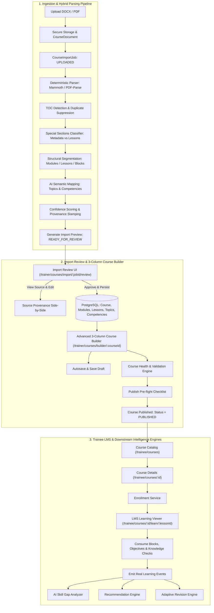

# Implementation Plan: End-to-End Course Builder Workflow
**Capacity Connect — Smart India Hackathon 2026 (Problem Statement SIH26075)**

This plan designs and executes the complete, production-grade **Course Builder Workflow** for Capacity Connect. It bridges document ingestion (DOCX/PDF), deterministic parsing, structure detection, AI-assisted semantic topic/competency mapping, import review, an advanced 3-column course authoring builder, draft autosave, publishing safety, trainee course discovery and enrollment, LMS learning viewer, and real learning event generation that powers the downstream Skill Gap, Recommendation, and Revision engines.

---

## User Review Required

> [!IMPORTANT]
> **Strict Source Document Integrity & Zero Mocking**
> - The uploaded document is the **SOURCE OF TRUTH** for imported content. The system will never hallucinate or invent missing course content.
> - If an element cannot be confidently extracted (e.g. an assessment question without an explicit answer), it will be flagged as `NEEDS_REVIEW`.
> - Every extracted content block retains source provenance (`sourceDocumentId`, `sourceSection`, `sourceParagraph`, `sourcePage`, `confidence`).
> - Table of Contents (TOC) is detected and treated strictly as navigation metadata; it is suppressed from becoming duplicate course modules/lessons.
> - Special sections (Course Overview, Learning Outcomes, Target Audience, Prerequisites, Glossary, References) are classified as course-level metadata and resources, never as lessons.
> - All persisted data will use the real PostgreSQL database via Prisma; all learning progress and assessments will generate real `LearningEvent` database records.

---

## System Architecture

---

## Proposed Changes

### Phase 1: Database Schema Extension & Persistence Layer

Extend the Prisma schema cleanly without altering existing models:
- **`CourseDocument`**:
  - `id`: UUID
  - `courseId`: String? (nullable before linking)
  - `fileName`, `fileType` (`DOCX` | `PDF`), `storageKey`, `fileSize`, `checksum`
  - `uploadedBy`: String (relation to `User`)
  - `uploadedAt`: DateTime
- **`CourseImportJob`**:
  - `id`: UUID
  - `courseDocumentId`: String (relation to `CourseDocument`)
  - `status`: Enum (`UPLOADED`, `PROCESSING`, `PARSING`, `ANALYZING`, `VALIDATING`, `READY_FOR_REVIEW`, `IMPORTING`, `COMPLETED`, `FAILED`)
  - `progress`: Float (0 to 100)
  - `error`: String?
  - `parsedData`: Json? (contains full hierarchy, confidence scores, detected TOC, source provenance)
  - `trainerId`: String
  - `courseId`: String?
  - `startedAt`, `completedAt`, `createdAt`, `updatedAt`
- **`Course` Model Enhancements**:
  - Add `overview` (String?), `targetAudience` (String?), `learningOutcomes` (Json?), `prerequisitesText` (String?), `glossary` (Json?), `references` (Json?), `version` (Int @default(1)).
- **`Lesson` Model Enhancements**:
  - `learningObjectives` (Json?), `keyTakeaways` (Json?), `sourceProvenance` (Json?).
  - `Lesson.content` will store structured `ContentBlock[]` JSON representations for rich educational elements.

---

### Phase 2: Hybrid Document Parser & Ingestion Pipeline (`backend/src/services/`)

#### [NEW] `backend/src/services/document-parser.service.ts`
1. **Deterministic DOCX Extraction**:
   - Uses `mammoth` to extract raw text, HTML semantic headings (`h1` - `h4`), lists (`ol`, `ul`), tables, and paragraphs.
2. **Deterministic PDF Extraction**:
   - Uses `pdf-parse` to extract page-by-page text, headings, and structure.
3. **Table of Contents (TOC) Detection & Duplicate Suppression**:
   - Regex and structural detection for TOC headings ("Table of Contents", "Contents", "Course Outline").
   - Extracts TOC items to build navigation expectations, then actively drops the TOC section from content extraction so modules and lessons are not duplicated!
4. **Special Sections Classifier**:
   - Classifies Course Overview, Target Audience, Learning Outcomes, Prerequisites, Glossary, and References.
   - Attaches them to course-level metadata and resources instead of turning them into lessons.
5. **Component Segmentation**:
   - Detects Modules (e.g. `MODULE 1: Advanced Atmospheric Dynamics`, `Chapter 1`).
   - Detects Lessons within modules (e.g. `1. Circulation Theorems and Pressure Systems`).
   - Extracts inside each lesson:
     - Learning Objectives ("By the end of this lesson...", bullet lists)
     - Content Blocks (Paragraphs, Headings, Bullet lists, Callouts, Examples, Tables, Quotes)
     - Key Takeaways
     - Knowledge Checks / Assessments (Questions, Question types, Choices, Correct Answers where explicitly noted, or flagged `NEEDS_REVIEW` if absent).
6. **Semantic Topic Extraction & Competency Mapping**:
   - Extracts key domain topics (e.g., Doppler velocity, Radar beam propagation, Cloud microphysics).
   - Maps topics to existing/new competencies in the database with confidence scores (`high` $\ge 0.90$, `review recommended` $0.70 - 0.89$, `needs review` $< 0.70$).
   - Suggests Topic Prerequisite DAG relationships.
7. **Source Provenance Stamping**:
   - Attaches `sourceDocumentId`, `sourceSection`, `sourceParagraph`, `sourcePage`, and `confidence` to every extracted node.

#### [NEW] `backend/src/services/course-import.service.ts`
- Manages ingestion jobs (`createJob`, `processJobAsync`, `getJobStatus`, `getJobPreview`, `approveJob`).
- Transactional course persistence in `approveJob`:
  - Creates `Course`, `CourseModule`, `Lesson`, `LearningTopic`, `LessonTopic`, `LearningTopicCompetency`, `AssessmentQuestion`, `QuestionOption`, `AssessmentQuestionTopic`.
  - Guarantees atomic database commit via `prisma.$transaction`.

---

### Phase 3: Backend APIs & Course Validation Engine

#### [MODIFY] `backend/src/routes/course.routes.ts` & `backend/src/controllers/course.controller.ts`
- Add Document Ingestion endpoints:
  - `POST /api/v1/courses/import` (Multer upload for PDF/DOCX, RBAC: Trainer/Admin)
  - `GET /api/v1/courses/import/:jobId` (Job polling status)
  - `GET /api/v1/courses/import/:jobId/preview` (Import preview with provenance & warnings)
  - `POST /api/v1/courses/import/:jobId/approve` (Approve & commit to database)
- Add Course Builder Validation & Publish endpoints:
  - `GET /api/v1/courses/:id/validate`: Runs Course Health check. Computes readiness score (0-100%), returns blocking `errors` and non-blocking `warnings`.
  - `POST /api/v1/courses/:id/publish`: Checks validation errors; transitions status to `PUBLISHED`; timestamps `publishedAt`.
  - `PATCH /api/v1/courses/:id/draft`: Autosave / Save Draft endpoint for atomic updates of course metadata, modules, and lessons.
  - `GET /api/v1/courses/:id/topics-competencies`: Retrieves lesson topic mappings, competencies, and dependencies.
  - `PUT /api/v1/courses/:id/topics-competencies`: Updates topic-competency mappings and prerequisite links.

---

### Phase 4: Frontend Upload & Import Review Experience

#### [MODIFY] `frontend/src/app/trainer/courses/new/page.tsx`
- Modern segmented control / tabs:
  - **Create Course Manually** (Existing form with improved UX).
  - **Import from Document** (Drag & Drop zone for PDF/DOCX).
- Drag & Drop zone with:
  - Drag-over active states, file size check (50MB), MIME/extension validation.
  - Upload progress bar, cancel, retry, clear error feedback.
  - On upload success, automatically navigates to `/trainer/courses/import/[jobId]/review`.

#### [NEW] `frontend/src/app/trainer/courses/import/[jobId]/review/page.tsx`
- Real-time job status tracker (`UPLOADED` $\rightarrow$ `PARSING` $\rightarrow$ `ANALYZING` $\rightarrow$ `VALIDATING` $\rightarrow$ `READY_FOR_REVIEW`).
- Executive summary metrics cards:
  - Modules, Lessons, Topics, Competency mappings, Knowledge checks, Confidence score (e.g. 96%).
  - Warnings banner with review items.
- Interactive Course Hierarchy Tree with confidence badges.
- **"View Source" side-by-side drawer / inspector**:
  - Clicking any module, lesson, objective, or question highlights the exact original source document section, paragraph, and page number.
- Action Buttons: "Approve & Open Course Builder", "Edit Metadata".

---

### Phase 5: Advanced 3-Column Course Builder (`/trainer/courses/[courseId]/builder`)

#### [MODIFY] `frontend/src/app/trainer/courses/[courseId]/builder/page.tsx`
Redesign into a professional 3-column SaaS authoring interface:
1. **Top Action Bar**:
   - Back to courses, Course Title, Status badge (`DRAFT`, `PUBLISHED`).
   - Autosave indicator: "Saving...", "Saved just now", "Unsaved changes" (with debounced save).
   - "Save Draft" button, "Publish Course" button, "Preview as Learner" button.
2. **Left Column (Course Hierarchy Sidebar)**:
   - Live database-backed hierarchy (Course $\rightarrow$ Modules $\rightarrow$ Lessons).
   - Search bar (filters modules, lessons, topics).
   - Reorder actions (move up/down, drag reordering).
   - Add Module, Add Lesson, Duplicate Lesson, Delete Lesson/Module, Rename.
   - Status indicators: Draft (`●`), Needs Review (`⚠`), Completed (`✓`).
3. **Center Column (Rich Content Editor)**:
   - Lesson Title & Description.
   - Learning Objectives editor: Structured individual objectives (add, edit, reorder, delete).
   - Structured Content Block Editor:
     - Blocks: Paragraph, Heading (H2, H3), Bullet List, Numbered List, Callout Box (Info, Warning, Tip), Example Box, Table, Quote, Code, Divider.
     - Add block picker, move up/down, delete block.
     - Provenance tag for imported blocks.
   - Key Takeaways editor.
   - Knowledge Checks / Quiz builder:
     - Add question, select question type (MCQ, True/False, Short Answer), options, correct answer toggle, explanation, difficulty.
4. **Right Column (Contextual Properties & Settings Panel)**:
   - **Tab 1: Properties / Settings**: Lesson duration, content type, preview toggle; Module settings; Course metadata.
   - **Tab 2: Competency Mapping**: Review lesson topics, mapped competencies, importance rating, confidence percentage, approve/reject toggle, prerequisite topic connector.
   - **Tab 3: Course Health & Validation**: Real-time validation checklist (Course Health %, Errors, Warnings). Clicking an error navigates directly to the affected module or lesson.
5. **Publish Pre-Flight Checklist Modal**:
   - Checks: Course info complete, Modules complete, Lessons have content, Assessments validated, Competencies reviewed.
   - Confirmation button to publish course.

---

### Phase 6: Trainee LMS Learning Player & Learning Event Generation

#### [NEW] `frontend/src/app/trainee/courses/[id]/learn/[lessonId]/page.tsx`
- Dedicated, distraction-free LMS Player:
  - Left collapsible curriculum sidebar with lesson completion ticks and active highlight.
  - Header with Course title and progress bar percentage.
  - Main lesson viewer:
    - Renders structured content blocks (formatted text, headings, callout boxes, example cards, tables).
    - Displays learning objectives and key takeaways.
    - Interactive Knowledge Checks: Trainee selects choices, submits answer, receives instant feedback with explanation.
    - Sequential navigation: "Previous Lesson", "Mark Complete", "Next Lesson".
- Emits real `LearningEvent` on lesson completion and quiz answer via `POST /api/v1/learning-events`:
  - Captures `topicId`, `lessonId`, `courseId`, `correct`, `responseTimeMs`, `confidenceRating`, `hintsUsed`.
  - Ingests directly into `learningPipelineService`, updating `UserTopicCompetency`, feeding the `AI Skill Gap Analyzer`, and updating the `Adaptive Revision Engine`.

---

## Verification Plan

### Automated Tests
1. **Parser & Ingestion Unit Tests**:
   - Create test script `backend/scripts/test-course-parser.ts`.
   - Ingest a multi-module syllabus document (`Forecasters Training Course.docx`).
   - Assert:
     - Course title parsed correctly.
     - Module count and names detected accurately.
     - Lesson count and names attached to correct modules.
     - Table of Contents detected and suppressed from content duplication.
     - Special sections (Overview, Target Audience, Glossary, References) routed to course metadata.
     - Objectives and knowledge checks extracted with source provenance.
     - Unambiguous topic-to-competency mappings have high confidence ($\ge 0.90$).
2. **End-to-End API Integration Tests**:
   - Create test script `backend/scripts/test-course-builder-flow.ts`.
   - Execute:
     - `POST /courses/import` $\rightarrow$ poll `GET /courses/import/:jobId` until `READY_FOR_REVIEW`.
     - `GET /courses/import/:jobId/preview` $\rightarrow$ assert structural counts.
     - `POST /courses/import/:jobId/approve` $\rightarrow$ assert database records created.
     - `GET /courses/:id/validate` $\rightarrow$ assert health check and zero blocking errors.
     - `POST /courses/:id/publish` $\rightarrow$ assert course status is `PUBLISHED`.
     - `POST /courses/:id/enroll` as Trainee $\rightarrow$ assert enrollment created.
     - Submit knowledge check $\rightarrow$ assert `LearningEvent` created and `UserTopicCompetency` updated.
3. **Build & Typecheck**:
   - Backend: `npm run typecheck` in `backend` (0 errors).
   - Frontend: `npm run typecheck` in `frontend` (0 errors).

### Manual & Visual Verification
- Use Browser tool or interactive browser to verify:
  1. `/trainer/courses/new` upload drag-and-drop experience.
  2. `/trainer/courses/import/[jobId]/review` preview metrics and "View Source" side-by-side.
  3. `/trainer/courses/builder/[courseId]` 3-column authoring, block editor, autosave, and competency mapping tab.
  4. Publish modal confirmation.
  5. Trainee course catalog `/trainee/courses` and LMS Player `/trainee/courses/[id]/learn/[lessonId]`.
